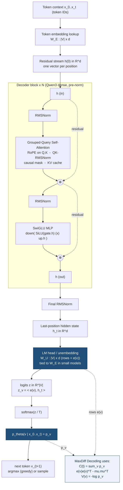

# Claude — Q&A scratchpad

---

## [2026-06-13] Adapting the Bayesian inference to races of varying length

**Source:** `research_papers/optimal_pacing_in_thoroughbred_racing/stage0/stage0.tex` (§Likelihood, §Stage 0 Parameters / Table 1, §Validation Protocol, Part II module architecture) and `…/methodology/methodology.tex` (§The Problem, §Inference).

This reframes nicely once you look at what's actually horse-intrinsic in the Stage 0 parameter table versus what belongs to a single race. The short version: **varying race lengths isn't an inconvenience to accommodate — it's the signal that finally identifies the physiology.** Here's the scoping.

### 1. The structural move: split the 11 parameters into horse-level and race-level

Right now all eleven parameters in Table 1 are fit to one race. Learning from a whole race history means recognizing that most of them are properties of the *horse* and must be **shared across every race**, while a few are properties of the *race* and get one copy per race:

**Horse-level (shared across all $R$ races) — these are the scientific targets:**
- $\tau$ (friction timescale), $f_M$ (max force/mass) — mechanical constants
- $\sigma_{\max},\ z_2, z_{12}, z_{01}\ (\to m_2,m_1,m_0),\ \beta_1,\beta_2$ — the aerobic-supply hump $\sigma(m)$ and the reserve scale

**Race-level (one per race $r$):**
- $v_{0,r}$ — gate velocity, set by the break/early pace, not physiology
- $\varphi_{T,r}$ — finishing reserve fraction (the crux — see §2)
- $D_r$ and the sector edges $\{s_{j,r}\}$ — **known, not parameters**; $D_r$ is just the integration limit and the partition

**Shared observation:** $\eta$ (one dispersion).

The BVP itself doesn't change — same three ODEs, same boundary conditions $v(0)=v_{0,r},\ u(0)=0,\ u(D_r)=\ln\varphi_{T,r}$ — it's just solved once per race with that race's $(D_r, v_{0,r}, \varphi_{T,r})$ against the *same* $\theta_H$. The model becomes a plate over races:

$$p(\theta_H, \{v_{0,r},\varphi_{T,r}\},\eta \mid \text{data}) \;\propto\; p(\theta_H)\,p(\eta)\prod_{r=1}^{R}\Big[\,p(v_{0,r})\,p(\varphi_{T,r})\prod_{j=1}^{J_r}\mathrm{Gamma}\big(\delta t_{j,r}\mid \widehat{\delta t}_{j,r}(\theta_H,\cdot),\eta\big)\Big].$$

The parameter-count payoff is concrete: the naive "fit each race separately" approach is $11R$ parameters with the physiology re-estimated (badly) every time. The pooled model is $8 + 2R + 1$. For ten races that's **29 parameters instead of 110**, and the 8 physiology parameters now see 10× the data.

### 2. The crux: $\varphi_T$ cannot stay a single shared constant

$\varphi_T = m(D)/m_0$ is the share of the tank left at the wire. The same horse finishes a 1000 m sprint with more in hand than a 2400 m route, so $\varphi_T$ is *not* horse-constant — it must vary with distance. Two ways to handle it, and I'd ladder them the way the paper already ladders model complexity:

- **(a) Free per-race $\varphi_{T,r}$ (start here).** Minimal change, lets the joint sampler run. Cost: it adds one weakly-identified nuisance per race, and because energy consumed is $m_0(1-\varphi_{T,r})$, a free $\varphi_{T,r}$ trades off against the shared $m_0$ *within* each race — which partly leaks away the pooling benefit for the reserve scale.
- **(b) Horse-level depletion law $\varphi_T(D_r;\theta_H)$ (graduate to this).** Replace $R$ free fractions with a monotone law — the horse empties more of a fixed tank over longer races. This is *more* physiological and turns the distance spread into shared, identifying information rather than per-race slack. It's also closer to the optimal-control spirit: the strict optimum is $\varphi_T\to0$, and the reserve a horse spares should be a smooth function of how far it had to go.

My recommendation: build the plumbing with (a), validate it, then graduate to (b) — exactly the "restore one block at a time" philosophy in your Stage 0→3 ladder.

### 3. Why this *helps* — the identifiability gain

Your own §D identifiability read flags $\beta_1,\beta_2$ as weakly identified and warns of ridges, because a single distance only exercises one slice of the aerobic hump and one aerobic/anaerobic balance. Different distances probe different physiology:
- **Sprints** are anaerobic/force-cap limited → informative about $f_M$, the reserve, early $\sigma$.
- **Routes** are aerobic-supply limited, the horse settling near sustainable $\sigma$ → informative about $\sigma_{\max}$ and the hump shape $(\beta_1,\beta_2,m_1,m_2)$.

Because each race traces $m(s)$ over a different range of $m$, pooling distances samples *more of the curve* $\sigma(m)$ — so the knee steepnesses that wash out in any single race become identifiable when several distances are fit jointly. This is the scientific argument for the whole exercise, and it's worth stating as the headline rather than treating multi-length as a complication.

### 4. Inference / computational adjustments

- **Normalize arclength to $\xi = s/D_r \in [0,1]$.** Then $\frac{d}{ds} = \frac1{D_r}\frac{d}{d\xi}$, so the system becomes $y'(\xi) = D_r\,F(y,\theta_H)$ with $D_r$ entering as a scalar multiplier. Every race now lives on the *same* domain $[0,1]$ and can share a **fixed collocation mesh of $N$ nodes**, which is what lets you `vmap` the BVP solve cleanly across races despite different $D_r$. This is the one structural tweak to the forward solver.
- **`vmap` over races** for the $R$ solves per leapfrog step; with $\xi$-normalization the shapes are static and it compiles once. Ragged sector counts $J_r$ are handled by padding to $J_{\max}$ with masked observations.
- **NaN robustness becomes load-bearing.** Today a non-convergent solve returns NaN; with $R$ solves per gradient step, the chance that *at least one* fails rises sharply, and one NaN poisons the whole joint density. You need a per-race policy — a finite penalty or a guaranteed-robust ramped guess across the full $D$-range — so a single bad solve doesn't kill the step.
- **Sampler geometry.** Once $\varphi_T$ (or, later, a hierarchical effort term) is shared through a horse-level law, you get the classic funnel — use a **non-centered parameterization** for any race-level latents drawn around a horse-level mean.

### 5. Likelihood — one subtle trap

The joint log-likelihood is just the sum over races; $\eta$ shared is the right default. But watch the interaction with Stage 0's *known* final-sector bias (your §"What Stage 0 Cannot Capture"): that bias is **systematic, not iid**, and it now appears in *every* pooled race, so it becomes a consistent pull on the shared physiology rather than averaging out. Two mitigations: down-weight or drop the final sector in the multi-race fit, and don't fully trust pooled physiology estimates until the discount/fatigue blocks (Stage 1+) are restored. This is an argument for doing the multi-race plumbing at Stage 0 but reserving *scientific* conclusions for later stages.

### 6. The honest caveats — what "every race" actually drags in

Races of varying length are rarely "same horse, same everything, just different $D$." Pooling silently assumes stationarity you should name:
- **Surface/going** (turf/dirt/synthetic; firm→heavy) changes effective resistance — i.e. $\tau$, possibly $\sigma$. If a horse's sprints are on dirt and routes on turf, surface confounds distance. Likely needs a race-level modulation $\tau_r = \tau\cdot g(\text{surface}_r)$.
- **Effort**: the model assumes a *time-optimal* trajectory subject to $\varphi_T$. A horse eased down or never asked isn't on an optimal path at all — $\varphi_T$ only captures "finished with reserve," not "wasn't trying." You may need to select/weight races or add a per-race effort latent.
- **Track geometry**: the methodology already drops slope $\alpha(s)$ and curvature $c(s)$; these differ across tracks of different length.
- **Career drift**: across a long history the physiology itself moves (maturation, fitness, injury), so $\theta_H$ stationary is an approximation — for long histories, consider windowing or slow time-variation.

### 7. Validation has to grow with it

The acceptance test (§Validation C) must become multi-distance SBC: pick a shared $\theta_H^\star$ plus a set $\{D_r\}$ with race nuisances, simulate all races, refit jointly, and confirm recovery of $\theta_H^\star$ — and crucially **demonstrate the posteriors are tighter than the single-race fit** (the $\beta$'s now pinned). That comparison is the experiment that earns the added structure.

**Where it lands:** this is mostly a Stage 0 / inference-layer change — the plate split in `model`, the $\xi$-normalized `solve`, the per-race likelihood — plus a $\varphi_T$ decision that recurs at every rung of the ladder. In the docs it touches `stage0.tex` §Likelihood + §Parameters (split the table into horse-level and race-level) and Part II `model`/`solve`, and the §Problem/§Inference framing in `methodology.tex`.

---

## [2026-06-09] Building the model incrementally before Bayesian inference

**Source:** `research_papers/optimal_pacing_in_thoroughbred_racing/methodology.tex`, §8–9 logit/force-cap reparameterization, §9 slew-rate saturation, §10 forward system, §11–12 Bayesian inference and hyperparameter values.

Strongly agree — and the instinct has a sharper justification than just "start simple." In this model the force-cap and slew modulations are *exactly* the parts that are (a) least empirically anchored and (b) numerically nastiest for the sampler. Adding them last is doubly motivated.

### Why these two pieces specifically should come last

**They're the weakest-identified block.** The hyperparameter section flags it: $\phi_{b,\min}$ has "no direct empirical anchor," $\kappa_f$ and $\kappa_b$ have "no published value," and $m_f^*, m_b^*$ are set by analogy. All six fatigue parameters act **near the finish** — and so does the discount $\alpha$ and the fall-off knee $\beta_2$. From coarse sector times you'll get a late-race confound where these trade off against each other along a ridge. You want to *watch* the posterior degrade as each block enters, not fit the whole thing and wonder why it won't mix.

**The slew saturation breaks gradient-based inference.** Eq. (20) wraps the EL rate in a $\clamp$ then $\tanh^{-1}$. The clamp has flat-gradient regions and discontinuous curvature — death for NUTS through an ODE adjoint solve. The smooth core (logit reparam alone) gives clean gradients; the slew layer doesn't. Confirm the sampler works on the smooth system *first*, then decide whether to soften the clamp (a `softclamp`) or fall back to SMC/gradient-free for the last stage.

### The ladder

Each stage nests in the next via an "off" limit, so you can use stage-$k$ posteriors to initialize and prior-anchor stage $k{+}1$:

- **Stage 0 — pipeline validation.** $\alpha=0$, $\phi_f\equiv 1$ ($\phi_{f,\min}\to1$), no slew ($\psi'=\psi'_\star$). Keep the logit reparam — it costs nothing and keeps $f$ bounded. This is monotone-decay (the model's own undiscounted/unfatigued limit). Fit it to **synthetic data from a known $\theta$** on one horse. Goal here isn't physics, it's proving integrator + Gamma likelihood + NUTS recover truth end-to-end.
- **Stage 1 — discount.** Turn on $(d,\varepsilon,\alpha)$. The finishing kick appears. Expect a ridge among the three — they only enter through $\rho(s)=\alpha/(d-s+\varepsilon)$, one curve from three knobs. Consider fixing $\varepsilon$.
- **Stage 2 — force-cap modulation.** Turn on $\phi_f$ ($\phi_{f,\min}, m_f^*, \kappa_f$) and the moving-cap term $-(\phi_f'/\phi_f)\,m\,u'$ in $\psi'_\star$. Still no slew.
- **Stage 3 — slew saturation.** Turn on $g(\eta;a,b)$, $a,b$, and $\phi_b$ ($\phi_{b,\min}, m_b^*, \kappa_b$). The off-limit is $a,b\to\infty$. This is where you confront the clamp.

Then the hierarchical cross-horse pooling, then the two stubbed sections (track response, competition correlation).

### Two disciplines that make the ladder pay off

1. **Synthetic-recovery at every stage**, not just stage 0. Simulate from known $\theta$, refit, check coverage. This separates non-identifiability from coding bugs before real-data ambiguity confounds both.
2. **Does the data even license the extra flexibility?** Because the stages nest, after fitting stage 3 on real sector times, check whether the fatigue posteriors actually move off their priors and whether held-out sector prediction (or LOO) improves over stage 2. If sector times can't distinguish $\phi_f\equiv1$ from a modulated cap, the betting layer shouldn't be consuming that parameter — and you'll want to know that before it does.

One numerical heads-up independent of staging: the $f_0$ prior puts the horse at the cap leaving the gate, so $\psi(0)$ starts large and the stiffening factor $1/(1-f/(f_M\phi_f))$ bites immediately. The first ~200 m may be stiff regardless of stage — plan for an implicit solver.

---

## [2026-06-09] Per-horse or total? How many $\theta$ draws

**Source:** `research_papers/optimal_pacing_in_thoroughbred_racing/methodology.tex`, §11 Bayesian inference and §13 posterior-predictive Monte-Carlo total-variance split.

**Per horse.** Each horse has its own posterior — fit from its own race history — and those posteriors are independent objects. There's no shared pool to draw $10^4$ from; "total across all horses" doesn't typecheck, because $\theta_3$ drawn from horse 3's posterior tells you nothing about horse 5. So you draw a cloud of $\sim\!10^3$–$10^4$ values of $\theta_i$ from *each horse's own* posterior, and solve the ODE for each. Total ODE solves $= N_\theta \times n_{\text{horses}}$ — e.g. $10^4 \times 7 = 7\times10^4$, still tiny next to $10^6$.

**Why per-horse is the right axis.** $N_\theta$ for horse $i$ controls how well you resolve *that horse's* parameter uncertainty — the outer term in the §13 total-variance split, restricted to horse $i$. If you instead split a fixed budget of $10^4$ across 7 horses ($\sim\!1400$ each), you'd be thinning every horse's posterior representation to save solves you don't need to save. The solves are cheap; don't ration them across horses.

**How the clouds become races.** Each horse $i$ now carries $N_\theta$ precomputed predicted-sector-mean vectors $\widehat{\delta t}^{(k)}_j$, one per posterior draw $k$. To assemble race $r$:

1. **Pick one $\theta$-index per horse, independently** — draw $k_i \sim \text{Uniform}(1,\dots,N_\theta)$ for each horse separately. Independent indexing is what marginalizes each horse over its *own* posterior; it's valid precisely because the posteriors are independent. (Don't use the same index $k$ for all horses — that would spuriously correlate their parameter draws.)
2. Apply the **shared race-day shocks** $z_r, \pi_r$ (one draw per race, broadcast across horses).
3. Draw **sector noise** and sum to race times, rank, tally.

With $N_\theta=10^4$ per horse and $10^6$ races, each precomputed $\theta$-draw gets reused $\sim\!100$ times — against different opponents, different shared shocks, different sector noise. That reuse is the whole point of the nested decoupling: it's what lets $7\times10^4$ ODE solves support $10^6$ effective races.

**Which of $10^3$ vs $10^4$.** Use $10^4$ per horse. $10^3$ is fine for marginal win/place/show probabilities, but the **outer (parameter) Monte-Carlo error** on a bet is governed by $N_\theta$, and the longshot exotics — exactly the ones already sitting at a few-percent *inner* relative error from the $10^6$ sizing — are sensitive to each horse's posterior tail. $10^4$ keeps the outer contribution from becoming the binding constraint, and it costs you only $7\times10^4$ solves, which `vmap`-batched is still seconds-to-minutes. If even $10^4$ solves turns out cheap in practice, there's no harm pushing further; the reuse economics don't change.

---

## [2026-06-09] JAX performance: the ODE solve is the only cost

**Source:** `research_papers/optimal_pacing_in_thoroughbred_racing/methodology.tex`, §10 forward system and §13 posterior-predictive Monte-Carlo; couplings in the §"Horse-Specific Track Response" / §"Competition-Based Correlation" stubs.

It's worth separating the procedure into two layers, because one of them is genuinely free in JAX and the other is the only thing you ever pay for.

**The back end is essentially free.** Once you have predicted sector means, the rest — sample Gamma sector times, sum to race times, `argsort` the field, tally bets — is pure vectorized array work. For $10^6$ races $\times\ 7$ horses $\times\ \sim\!8$ sectors that's $\sim\!10^8$ Gamma draws plus a $10^6\times 7$ `argsort` and some boolean reductions. JIT-compiled on a GPU this is sub-second to a few seconds. `jax.random.gamma` is reparameterized and `vmap`-friendly; `jnp.argsort` along the horse axis ranks the whole campaign in one call; each bet type is a mask-and-mean over the finishing-order array. This layer scales with *races*, not bet types, so all ~20 bets score in the same pass. Nothing here is a bottleneck.

**The ODE solve is the real cost — and how often you pay it is your design choice.** The predicted sector means $\widehat{\delta t}_j(\theta_i)$ come from the forward optimal-pacing system. That solve, not the sampling, dominates wall-clock. The question is how many *distinct* $\theta$'s you integrate:

- **Point-estimate / single draw per horse:** solve the ODE once per horse (7 solves total), get $\widehat{\delta t}_j$, then spin $10^6$ races as pure Gamma resampling. This is the "surprisingly quick" case you're imagining — and it's correct, it's just *plug-in* predictive (ignores parameter uncertainty).
- **Full posterior-predictive:** a fresh $\theta_i \sim$ posterior per race means $7\times10^6$ ODE solves. Even at ~1 ms each that's hours single-threaded; `vmap`-batched on GPU with a fixed-step explicit solver it's minutes, but it's unambiguously the expensive part.

**The fix is the nested structure you already have.** Don't couple "number of $\theta$ draws" to "number of races." Draw a modest outer set of $\theta$'s — say $10^3$–$10^4$ — solve the ODE for each (this is the batched `diffrax` call), then draw many inner sector-noise replicates per $\theta$. That's exactly the law-of-total-variance decomposition from §13: outer $\theta$ carries parameter uncertainty, inner Gamma carries sector noise, and you get the full $10^6$ effective races while paying for only $\sim\!10^4$ solves. Nested `vmap` maps onto it directly: `vmap` over $\theta$ on the ODE, `vmap` over replicates on the sampler.

**A few JAX specifics that bite here:**

1. **Use `diffrax`** for the solve — JAX-native, `vmap`+`jit`+GPU. Prefer a **fixed-step** explicit solver if the dynamics allow; adaptive stepping gives ragged step counts that `vmap` handles only via masking/padding overhead.
2. **Enable `jax_enable_x64`.** JAX defaults to float32. Gamma tails and `argsort` tie-breaking on near-equal race times want float64, or your longshot-permutation probabilities pick up quantization noise right where they're already thin.
3. **Watch recompilation.** Keep batch shapes static so JIT compiles once; a changing field size or sector count retriggers compilation and hides the real runtime.
4. **Split PRNG keys** structurally — one branch per layer ($\theta$, shared shocks, sector noise) — so results are reproducible and the layers stay independent.

**The structural correctness reminder, in code terms.** The shared race-day shocks ($z_r$ on $\tau$, the signed pace factor $\pi_r$) are sampled **once per race and broadcast across the 7 horses** — a `(races, 1)` draw multiplied/added against the `(races, horses)` array. Sector noise is the full `(races, horses, sectors)` draw. Get that broadcasting axis wrong — sample $z_r$ per horse instead of per race — and you've silently turned a shared shock into private noise, which destroys the coupling and the bets won't move.

So: yes, fast — but the speed comes from keeping the ODE-solve count small and the Gamma/rank/tally layer fat, not from brute-forcing $10^6$ independent solves.

---

## [2026-06-09] What $10^6$ simulations per race buys you in precision

**Source:** `research_papers/optimal_pacing_in_thoroughbred_racing/methodology.tex`, §13 posterior-predictive Monte-Carlo; builds on the sample-sizing and SE entries below.

$10^6$ is comfortably generous for almost everything you'll compute — here is where it's overkill and where it's merely adequate, using the sizing rules derived earlier.

**Absolute precision** is $\mathrm{SE}(\hat p)=\sqrt{p(1-p)/S}$. At $S=10^6$:

| $p$ (true prob.) | $\mathrm{SE}(\hat p)$ | 95% half-width $\approx 2\,\mathrm{SE}$ |
|---|---|---|
| $0.50$ | $5.0\times10^{-4}$ | $\pm 0.0010$ |
| $0.14$ (win, fair 7-horse) | $3.5\times10^{-4}$ | $\pm 0.0007$ |
| $0.01$ | $9.9\times10^{-5}$ | $\pm 0.0002$ |
| $0.001$ (a cold exacta/trifecta) | $3.2\times10^{-5}$ | $\pm 0.00006$ |

So every win/place/show and most exotics land with three to four significant digits. Absolute error is never your problem at $10^6$.

**Relative precision** is the honest metric for rare bets, $r = \mathrm{SE}/p \approx \sqrt{1/(pS)}$ (the $\sqrt{(1-p)/(pS)}$ form, with $1-p\approx1$):

$$r \approx \sqrt{\frac{1}{pS}} = \sqrt{\frac{1}{p\cdot 10^6}}.$$

| $p$ | expected hits $pS$ | relative error $r$ |
|---|---|---|
| $0.14$ | $1.4\times10^5$ | $0.27\%$ |
| $0.01$ | $10{,}000$ | $1.0\%$ |
| $10^{-3}$ | $1{,}000$ | $3.2\%$ |
| $10^{-4}$ | $100$ | $10\%$ |
| $10^{-5}$ | $10$ | $32\%$ |

**The takeaway.** $10^6$ holds every bet down to $p\sim10^{-3}$ to within a few percent relative — that covers win, place, show, quinella, exacta, and the common trifectas. The floor is a **full trifecta/superfecta on a longshot permutation** in a 7-horse field: a specific ordering of all 7 has fair probability $1/7! \approx 2.0\times10^{-4}$, giving $\sim 200$ expected hits and $r\approx7\%$. A *superfecta* (top-4 ordering), $1/(7\cdot6\cdot5\cdot4)=1/840\approx1.2\times10^{-3}$, gives $\sim 1200$ hits and $r\approx3\%$ — fine. Only the deepest, longest-odds exotics push $r$ above $\sim10\%$.

**Two practical notes:**

1. **Reuse the field, don't re-simulate per bet.** One simulated race produces a full finishing order, which scores *all ~20 bet types simultaneously*. So $10^6$ races $\neq$ $10^6$ per bet — you get $10^6$ correlated samples for every bet at once, for the price of one simulation campaign. The cost scales with races, not bet types.

2. **Variance-reduction earns its keep only at the tail.** If a specific longshot exotic is the one you care about and $r\approx30\%$ bothers you, that's where the conditional-expectation (Rao-Blackwell) plug-in or importance sampling pays off — it's $p$-independent in relative terms. For the bulk of the menu, plain tallying at $10^6$ is already past the point of diminishing returns; runtime per race (the ODE solve plus the coupling draws) will dominate your wall-clock long before sampling error does.

---

## [2026-06-09] Committing to the Monte-Carlo approach: consequences

**Source:** `research_papers/optimal_pacing_in_thoroughbred_racing/methodology.tex`, §13 posterior-predictive race time; the couplings live in the (still-empty) §"Horse-Specific Track Response" and §"Competition-Based Correlation" stubs.

Going fully Monte-Carlo (to fold in more realism without approximating the race-time distribution) cleanly resolves the tension that ran through the last several discussions. A few consequences worth keeping in view:

**What Monte Carlo buys you.** You stop needing the conditional density $T_i \mid \theta_i$ in closed form. No Moschopoulos series, no saddlepoint, no moment-matched Gamma. You draw sector times directly from their Gamma likelihoods, sum to a race time per horse, rank the field, and tally bet outcomes. Every piece of realism that was awkward analytically — the **shared track shock** $z_r$ on $\tau$, **horse-specific loadings**, the **signed pace factor** $\pi_r$ with running-style $\beta_i$ — becomes a few extra lines inside the per-race draw, because you only ever need to *sample* from those couplings, never integrate against them. That's exactly the "fold in more realism" payoff.

**What you give up, and how to claw it back.** Raw simulation reintroduces the inner Monte-Carlo noise that Rao-Blackwellization was killing. You don't have to choose between them, though. The hybrid is:

- Sample the **shared/coupling** layer (race-day $z_r$, pace $\pi_r$) — the part that's hard to integrate analytically.
- *Given* that draw, the horses are conditionally independent, so you can still Rao-Blackwellize the **within-horse** layer wherever a conditional expectation is cheap — e.g. plug the conditional win-probability integrand $\int f_i \prod_{j\neq i}(1-F_j)$ rather than a 0/1 win indicator, if you happen to have the per-horse $F_j$ from the same draw.

In practice, if you're going fully sample-based for simplicity, just lean on the sizing rule we derived: with the plain indicator estimator, $S \approx \dfrac{1}{p_{\min} r^2}$ races governs your precision, and the rarest bet type sets the bill. Track per-bet $\mathrm{SE}(\hat p)=\sqrt{\hat p(1-\hat p)/S}$ and use Wilson intervals for the rare ones.

**One thing to preserve.** The structural insight survives the switch to simulation untouched: a *common multiplicative* time-scaling still cancels in the ranking, so it changes nobody's win probability. For the couplings to move orderings, your sampled shocks must be **heterogeneous** across horses (loadings $\lambda_i$, signed $\beta_i$). Easy to get wrong in code — if every horse multiplies its time by the same sampled $z_r$, your simulation will correctly report zero effect on bet probabilities and it'll look like a bug.

---

## [2026-06-08] Derivation: standard error of a probability $p$ estimated from $S$ races

**Source:** `research_papers/optimal_pacing_in_thoroughbred_racing/methodology.tex`, §13 posterior-predictive Monte-Carlo; underpins the sample-sizing entry below.

The standard error comes from treating each simulated race as a Bernoulli trial. Here is the derivation end to end.

### Setup

You want $p = P(\text{event})$ — the event being "this bet wins" (a specific finishing pattern). Run $S$ independent simulated races. Each race $s$ yields an indicator

$$X_s = \mathbb 1[\text{event occurred in race } s], \qquad X_s \in \{0,1\}.$$

Because the races are independent draws from the same predictive model, the $X_s$ are i.i.d. $\text{Bernoulli}(p)$. The estimator is the hit frequency

$$\hat p = \frac{1}{S}\sum_{s=1}^S X_s.$$

### Step 1 — it's unbiased

$$\mathbb E[\hat p] = \frac1S\sum_{s=1}^S \mathbb E[X_s] = \frac1S\cdot S p = p,$$

using $\mathbb E[X_s] = 1\cdot p + 0\cdot(1-p) = p$.

### Step 2 — variance of a single race

For an indicator, $X_s^2 = X_s$ (since $0^2=0,\,1^2=1$), so $\mathbb E[X_s^2] = \mathbb E[X_s] = p$. Then

$$\operatorname{Var}(X_s) = \mathbb E[X_s^2] - \big(\mathbb E[X_s]\big)^2 = p - p^2 = p(1-p).$$

This is the Bernoulli variance — maximal at $p=\tfrac12$, vanishing as $p\to 0$ or $1$.

### Step 3 — variance of the average

Independence makes the variance of the sum the sum of the variances, and the $1/S$ factor pulls out squared:

$$\operatorname{Var}(\hat p) = \operatorname{Var}\!\left(\frac1S\sum_{s=1}^S X_s\right) = \frac{1}{S^2}\sum_{s=1}^S \operatorname{Var}(X_s) = \frac{1}{S^2}\cdot S\,p(1-p) = \frac{p(1-p)}{S}.$$

Equivalently: the hit count $K=\sum_s X_s \sim \text{Binomial}(S,p)$ has variance $Sp(1-p)$, and $\hat p = K/S$ scales that by $1/S^2$.

### Step 4 — the standard error

The standard error is the standard deviation of the estimator:

$$\boxed{\operatorname{SE}(\hat p) = \sqrt{\operatorname{Var}(\hat p)} = \sqrt{\frac{p(1-p)}{S}}.}$$

In practice $p$ is unknown, so you plug in the estimate:

$$\widehat{\operatorname{SE}}(\hat p) = \sqrt{\frac{\hat p(1-\hat p)}{S}}.$$

By the CLT, $\hat p \approx \mathcal N\!\big(p,\,p(1-p)/S\big)$ for large $S$, giving the Wald interval $\hat p \pm 1.96\,\widehat{\operatorname{SE}}$.

### Step 5 — relative error (the form used for sizing $S$)

Dividing the SE by $p$ gives the relative (fractional) error:

$$\frac{\operatorname{SE}(\hat p)}{p} = \sqrt{\frac{p(1-p)}{S}}\cdot\frac1p = \sqrt{\frac{1-p}{p\,S}} \;\xrightarrow{p\to 0}\; \sqrt{\frac{1}{pS}}.$$

Setting this equal to a target $r$ and solving gives the sizing rule $S \approx 1/(p\,r^2)$ — and the $1/p$ is precisely why rare bets are expensive: the *absolute* SE shrinks as $p\to0$, but the *relative* SE blows up.

(Caveat: the Wald SE degrades for rare events — when $S\hat p$ is small, the normal approximation is poor and $\hat p$ can even be 0, giving $\widehat{\operatorname{SE}}=0$. Use the Wilson or Clopper–Pearson interval there instead.)

### Why Rao–Blackwell breaks the $1/p$ dependence

The same algebra shows what the RB estimator removes. Replace the $\{0,1\}$ indicator with the per-draw conditional probability $P_s = P(\text{event}\mid \theta^{(s)},z^{(s)},\pi^{(s)}) \in [0,1]$. It stays unbiased by the tower rule, $\mathbb E[P_s]=\mathbb E[\mathbb E[X_s\mid\cdot]]=p$. The law of total variance splits the original per-race variance:

$$\underbrace{\operatorname{Var}(X_s)}_{p(1-p)} = \underbrace{\mathbb E\big[\operatorname{Var}(X_s\mid\cdot)\big]}_{\mathbb E[P_s(1-P_s)]\ \text{— within-race}} + \underbrace{\operatorname{Var}\big(\mathbb E[X_s\mid\cdot]\big)}_{\operatorname{Var}(P_s)\ \text{— parameter}}.$$

The RB estimator keeps only the second term, so $\operatorname{Var}(P_s) = p(1-p) - \mathbb E[P_s(1-P_s)] \le p(1-p)$ — the Rao–Blackwell guarantee, the inequality being exactly the within-race binomial scatter you integrated out. For a rare bet $p(1-p)\approx p$ explodes the relative error, whereas $\operatorname{Var}(P_s)\approx p^2\,\text{CV}^2$ scales as $p^2$, so the relative variance $\operatorname{Var}(P_s)/p^2 \approx \text{CV}^2$ is $O(1)$ — independent of $p$. That is the $S_{\text{RB}}\approx \text{CV}^2/r^2$ from the last answer.

---

## [2026-06-08] How many race simulations for precise win probabilities across ~20 bet types, 7-horse field?

**Source:** `research_papers/optimal_pacing_in_thoroughbred_racing/methodology.tex`, §13 posterior-predictive Monte-Carlo; applies the Rao–Blackwell and ordering-integral threads below.

Front-loaded answer: it's **either ~a few thousand or ~several hundred thousand**, and which one depends entirely on whether you Rao–Blackwellize. The binding constraint is the *rarest* bet, not the number of bet types.

### The governing formula

For a plain "count the hits / $S$" estimator, a probability $p$ estimated from $S$ races has relative standard error $\sqrt{(1-p)/(pS)}$. To hit relative error $r$ on the smallest probability you care about:

$$S_{\text{naive}} \approx \frac{1}{p_{\min}\, r^2}.$$

The 20 bet types don't enter directly — you just size for the worst (smallest-$p$) one, and the other 19 come along for free. (Estimation, not testing, so no multiplicity penalty.)

### What $p_{\min}$ is with 7 horses

Baseline probabilities for a roughly even field (they shift up for a favorite, *down* for longshot combinations):

| Bet | $p$ (even field) | $S$ for 5% rel. error | $S$ for 10% |
|---|---|---|---|
| Place (top-2) | $0.29$ | $1{,}000$ | $250$ |
| Win | $0.14$ | $2{,}400$ | $600$ |
| Quinella | $0.048$ | $8{,}000$ | $2{,}000$ |
| Exacta | $0.024$ | $16{,}000$ | $4{,}000$ |
| Trifecta | $0.0048$ | $84{,}000$ | $21{,}000$ |
| Superfecta | $0.0012$ | $335{,}000$ | $84{,}000$ |

So if your 20 types stop at exacta/quinella, naive simulation needs ~$10^4$. If they include trifecta/superfecta, you're at $10^5$–$10^6$ — and a superfecta on *specific longshots* ($p\sim10^{-4}$) pushes naive counting into the millions. That tail is exactly where raw simulation falls apart.

### Rao–Blackwellize and the $p$-dependence disappears

Here's the payoff of the machinery from the earlier threads. If, per outer draw of $(\theta, z, \pi)$, you compute the bet's probability **analytically** — the nested-tail ordering recursion gives exact win/place/exacta/trifecta/superfecta probabilities in $O(nN)$ — you replace the noisy $\{0,1\}$ hit indicator with a smooth conditional probability $P_s \in [0,1]$. Then the estimator variance is the spread of $P_s$ across draws, which is the *parameter/track/pace* uncertainty, not the binomial $p(1-p)$ scatter:

$$S_{\text{RB}} \approx \frac{\text{CV}^2}{r^2},$$

where CV is the relative spread of the conditional probability across the posterior — and crucially this is **$O(1)$ regardless of how rare the bet is.** With CV $\approx 1$ and $r = 0.05$, that's $S_{\text{RB}}\approx 400$; conservatively (CV $\approx 2$), $\approx 1{,}600$. The same few thousand outer draws give precise estimates for **all 20 bet types at once**, deep exotics included, because the part that exploded for rare bets — the inner sampling noise — is gone.

### Recommendation

- **Use the RB hybrid** (outer MC over $(\theta,z,\pi)$, analytic ordering integral per draw): **5,000–10,000 race simulations** gives you ~1% relative on win/place and a comfortable few-% on the rarest superfecta, all 20 types simultaneously. This is the path the variance-reduction work was built for.
- **If you insist on naive count-the-hits**, size for the rarest bet via $S \approx 1/(p_{\min}r^2)$: budget **~300k** for 5%-relative superfectas, and add **importance sampling** for any specific longshot ticket below $\sim10^{-3}$, or the count never stabilizes.
- Either way, **report the per-bet MC standard error** — with a 7-horse field the precision spans two orders of magnitude across bet types, so a single "number of simulations" hides which estimates are tight and which aren't.

---

## [2026-06-08] Is it unreasonable to use simulation to estimate bet win/loss probabilities?

**Source:** `research_papers/optimal_pacing_in_thoroughbred_racing/methodology.tex`, §13 posterior-predictive Monte-Carlo; builds on the ordering-integral and Rao–Blackwell threads below.

Not unreasonable at all — it's the natural tool, and in fact **§13 already *is* that simulation.** The posterior-predictive Monte-Carlo loop draws parameters, integrates the forward system, and produces a race-time vector per simulated race. A bet outcome is just a **deterministic functional of that vector**: read off the finishing order (or times), apply the bet's payoff rule, average over draws. You don't need new machinery — bets are a layer on top of what you've built.

So the question isn't really "is simulation reasonable" but "where is it the right tool vs. where does it waste the variance reduction you already have." Three cases:

### Where simulation is clearly the right call

For anything beyond win/place, simulation dominates, because bets need the **joint** distribution of outcomes and simulation gives the joint for free:

- **Exotics** (exacta, trifecta, superfecta) — the analytic nested-tail integrals from earlier are exact but get combinatorially heavy past 2nd–3rd place. Simulation just plays out the order and checks the ticket.
- **Cross-race parlays / multi-leg bets** (daily double, Pick-6) — these couple *different races* through shared state (weather persisting across the card). Stitching marginal win-probs together is wrong when legs are correlated; simulation propagates the coupling automatically.
- **Pool-dependent (pari-mutuel) payoffs** — the dividend depends on how the crowd bet, and your own stake moves the pool. That's a nonlinear payoff function; simulation handles arbitrary payoff nonlinearity, analytic routes don't.

For these, "simulate the race, evaluate the ticket" is not a compromise — it's the cleanest correct method.

### Where raw simulation is wasteful

For the **simple** bets — win, and the place/ordering probabilities — you already have the variance-reduced analytic route (the competition integral $\int f_i\prod_{j\neq i}\bar F_j$ and the nested-tail recursion). Estimating those by raw sampling throws away exactly the Rao–Blackwellization we spent the earlier answers building. The MC standard error on a probability is $\sqrt{p(1-p)/S}$, and for **rare-event bets** (a specific superfecta, a longshot) the *relative* error $\sqrt{(1-p)/(pS)}$ blows up as $p\to 0$ — you'd need enormous $S$ for a tail probability. So naive simulation is weakest precisely on the low-probability, high-payout tickets where you most want accuracy.

### The design that resolves it: Rao–Blackwell hybrid

This is the natural extension of the variance reduction already in the paper. **Simulate the outer uncertainty, integrate the inner scatter analytically:**

1. Draw the outer layer — parameters $\theta^{(s)}$, the shared race-day state $z^{(s)}$, the pace factor $\pi_r^{(s)}$ — by Monte Carlo (these genuinely need sampling; they're low-dimensional and there's no closed form).
2. *Conditional on that draw*, the horses are independent with known densities $f_i^{(s)}, F_i^{(s)}$ (the within-race scatter integrated out). Compute the bet's win/loss probability **analytically** where you can — the ordering integral for win/place/exacta — yielding a smooth value in $[0,1]$.
3. Average those conditional probabilities over $s$.

You replace the noisy $\{0,1\}$ "did the ticket hit" indicator with its conditional expectation per draw — the same RB move, now at the bet level. For exotics too hairy to integrate, fall back to playing out the order *within* each draw, but you've still removed the within-race scatter noise.

### Add-ons for the rare-event tickets

- **Common random numbers** — reuse the same shared $(z,\pi)$ draw across all horses and all bets in a race (the coupling already does this); it correlates estimates and sharpens *comparisons* between tickets.
- **Importance sampling / stratification** for deep longshots — tilt the draws toward the outcomes that make the ticket hit, then reweight.
- **Always report the MC standard error.** Simulation is only "unreasonable" if you quote a bet probability without its error bar, or if you simulate inner scatter you could have integrated.

**Verdict:** reasonable and, for exotics and EV under realistic payoff structures, the *preferred* method — your §13 loop is already the engine. Just keep the analytic route for the simple bets (don't discard the variance reduction), Rao–Blackwellize the bet probability per draw, and reach for importance sampling on the rare tickets.

---

## [2026-06-08] Parsimonious, physically appropriate competition-based correlation: a mean-field pace factor with signed loadings

**Source:** `research_papers/optimal_pacing_in_thoroughbred_racing/methodology.tex`, §2 reserve/energy depletion, §13 shared race-day state; develops rung #5 (pace/draft coupling) from the correlation-ladder thread below.

The full competition coupling (#5 from the ladder) is an $n$-body simulation that breaks conditional independence and costs you the factorized orderings and the Rao–Blackwellization. The good news: almost all of its *physical content* survives a **mean-field reduction** that stays inside the conditionally-independent framework. That reduction is the parsimonious, physically appropriate answer.

### The move: replace pairwise coupling with one shared *pace* factor

Horses don't really respond to each rival individually — they respond to **the pace of the race**, which is a single, low-dimensional, emergent property of how the race is run: honest/contested vs. slow/tactical. So introduce one shared latent per race,

$$\pi_r \quad(\text{mean zero; } \pi_r>0 = \text{a fast, contested pace}),$$

common to the whole field, and let each horse respond to it. This is the mean-field closure of the pack dynamics: every runner reacts to the *aggregate* pace, not to named opponents. Crucially, **given $\pi_r$ the horses are conditionally independent again** — so the factorized ordering integrals and the RB machinery from the earlier answers all still apply. You've converted a coupled-ODE problem into one extra shared latent, exactly like the going shock.

### What makes it *competition* and not *environment*: signed loadings

This is the physically essential part, and it's where the pace factor differs in kind from the going shock. The going moves everyone the **same** direction (everyone slower on heavy) — same-sign loadings, **positive** correlation. A fast pace is closer to **zero-sum** between running styles:

- **front-runners / pace-pressers** are *hurt* by a hot pace — they over-spend the anaerobic reserve early and fade (the §2 energy depletion biting at the finish): loading $\beta_i > 0$ (hot pace → slower → larger log-time);
- **closers / off-the-pace runners** are *helped* — the leaders come back to them: loading $\beta_i < 0$.

So the construction is

$$\ln T_i \;\supset\; \beta_i\,\pi_r, \qquad \operatorname{Cov}(\ln T_i,\ln T_{i'}) = \beta_i\beta_{i'}\operatorname{Var}(\pi_r),$$

and because the $\beta$'s carry **opposite signs across styles**, this produces **negative** correlation between front-runners and closers and positive correlation within a style. That mixed-sign structure is the fingerprint of competition — and a same-sign environmental factor structurally cannot generate it. Capturing it is the whole reason to bother with a competition term, and one signed factor is enough to get it.

### The parsimony multiplier: don't make $\beta_i$ a free parameter — read it off the horse's own optimum

Here's where the model already does the work for you. A horse's running style isn't an extra latent — it's a **derived feature of its own optimal trajectory**, which you already solve for. How front-loaded a horse's effort is (its early velocity/force relative to late, governed by its discount horizon $d$, slew rates, and reserve) *is* its pace exposure. So define the loading from the forward solve, e.g.

$$\beta_i \;=\; \frac{\text{early-race effort}}{\text{late-race effort}} - 1 \quad(\text{front-loaded} \Rightarrow \beta_i>0),$$

some monotone functional of horse $i$'s optimal $(v,f)$ profile over the first third vs. the last third. No new per-horse free parameter, and the front-runner/closer axis emerges from the same $\theta_i$ already in the model. This is maximally parsimonious *and* maximally physical — the competition exposure is mechanistically tied to how the horse chooses to run.

### Optional, still cheap: let the pace *emerge* from the field

A field full of front-runners runs a hot pace; a field of closers crawls. You can capture that — without any $n$-body integration — by making the pace factor's **mean** a deterministic function of the field's aggregate front-running tendency:

$$\pi_r = \underbrace{\theta_\pi \textstyle\sum_i \beta_i^{+}}_{\text{expected pace from field composition}} + \underbrace{\xi_r}_{\text{honest/false-pace residual}}, \qquad \xi_r\sim\mathcal N(0,\omega_\pi^2).$$

The first term is the genuine emergence (more cumulative early speed in the field → faster expected pace), the second is the irreducible "some days the pace is honest, some days it falls apart." It's a function of quantities you already have, evaluated once per race, so it stays conditionally independent given $\xi_r$.

### Where it enters, physically

The honest channel is **energy**: pace pressure draws down the anaerobic reserve $m$ early, leaving less for the finish — so the most physical placement modulates the early reserve depletion (or equivalently the early force budget) in §2, and the fade falls out of the existing dynamics. For a *parsimonious* first cut, apply it as the signed log-time shift above (the net effect on total time), and only push it into the reserve channel if you want the within-race sector pattern (fast early → slow late) to come out mechanistically.

---

**Recommendation.** One shared, mean-zero pace factor $\pi_r$ per race; horse loadings $\beta_i$ **derived from each horse's own optimal-trajectory shape** (front-loaded → positive), not fitted; optionally an endogenous mean from the field's aggregate front-running tendency. That is the minimal construction that (a) is genuinely competition-driven, (b) produces the correct mixed-sign correlation environment can't, (c) adds essentially **one latent and zero free per-horse parameters**, and (d) keeps you inside the conditionally-independent world so you don't forfeit the ordering integrals or the variance reduction. It's the mean-field shadow of #5 at a tiny fraction of the cost.

---

## [2026-06-08] What is $\mu_\tau$?

**Source:** `research_papers/optimal_pacing_in_thoroughbred_racing/methodology.tex`, §12 hyperparameter table ($\tau$: $\mu_\tau=\ln(3.76)=1.324$); continues the crossed horse × track decomposition below.

$\mu_\tau$ is the **grand mean of the log friction timescale** — the fixed, population-wide intercept of the decomposition

$$\ln\tau_{i,r} = \mu_\tau + b_i + \lambda_i z_r + a_{i,t(r)}.$$

It's the single number the whole hierarchy deviates *from*. Everything else is a mean-zero (or mean-one, for $\lambda_i$) perturbation around it:

- $\mu_\tau$ — the average log-$\tau$ over **all horses and all tracks**; a fixed effect, one scalar for the population.
- $b_i$ — horse $i$'s persistent deviation from that average (mean zero across horses).
- $\lambda_i z_r$ — the shared race shock, also mean zero.
- $a_{i,t}$ — private going-affinity, mean zero.

So $e^{\mu_\tau}$ is the typical friction timescale of a generic horse on a reference/average track — the "centre of gravity" of the $\tau$ population. Concretely, it's the same quantity your existing prior already anchors: in the hyperparameter table $\tau$ carries $\mu_\tau = \ln(3.76) = 1.324$ (the cross-horse M&A mean), so $e^{\mu_\tau}\approx 3.76$ s. In the non-hierarchical model that was *the* prior mean for $\tau$; the hierarchy just promotes it to the explicit grand intercept and hangs the random effects off it.

Two notes on bookkeeping:

- **It absorbs the level, which is why the random effects must be mean-zero.** If you let $b_i$ or $z_r$ have a free nonzero mean, it would trade off against $\mu_\tau$ — the same level-confounding from a couple answers back, now between the intercept and the random effects. Centering them at zero is what makes $\mu_\tau$ identified as *the* level.

- **It interacts with the anchoring choice.** If you set a reference going ($z_{\text{good}}\equiv 0$) rather than grand-mean-zero track effects, then $\mu_\tau$ becomes the average log-$\tau$ *on good going specifically*, not averaged over track types. Same parameter, shifted interpretation depending on where you pin the zero.

---

## [2026-06-08] Horse-specific track response: random slope vs. private affinity, and which one actually couples the field

**Source:** `research_papers/optimal_pacing_in_thoroughbred_racing/methodology.tex`, §1 dynamics (friction timescale $\tau$), §13 shared race-day state; continues the crossed horse × track thread below.

Right, and this is an important sharpening — but it comes with a subtle fork that you have to get right, because one version of "horse-specific track effect" quietly **destroys the very correlation you built the shock to create.** Let me lay it out.

### What you're describing: random intercept → random slope

Your two points are the two standard pieces of a crossed mixed model:

- **"Different horses have different $\tau$"** = a horse random **intercept** $b_i$.
- **"Different horses have different $z$ for different track types"** = a horse × track **slope/interaction** — the horse's *going preference*.

Both are right and compatible. But the interaction can enter in **two physically distinct ways**, and they have opposite consequences for coupling:

$$\ln\tau_{i,r} = \mu_\tau + \underbrace{b_i}_{\text{horse baseline}} + \underbrace{\lambda_i\, z_{r}}_{\text{gain on the \emph{shared} shock}} + \underbrace{a_{i,\,t(r)}}_{\text{\emph{private} going-affinity}},$$

with $z_r = z_{t(r)} + \epsilon_r$ the shared race shock (persistent going mean + per-race residual) from before.

### The fork — and the trap

**Flavor A — a loading on the shared shock, $\lambda_i z_r$.** Every horse reacts to the *same* common $z_r$, but with its own **gain** $\lambda_i$ (centered at 1, spread across horses; a mudlark can even have $\lambda_i<0$, gaining on heavy ground). This is horse-specific *and still coupled*, because the common factor $z_r$ is shared.

**Flavor B — a private interaction, $a_{i,t}$.** A horse-and-track effect drawn independently per horse: "this horse just runs $X\%$ slower on soft, idiosyncratically." This is horse-specific but **not** coupled to anyone else.

The trap: if you take your refinement literally and give each horse its *own free* track effect $z_{i,t}$ with nothing shared, you've collapsed to Flavor B only — and then the horses are **independent again**. You'd have deleted the §13 coupling that was the entire point of putting the shock on $\tau$. So the rule is: **decompose, don't replace.** Keep a genuinely shared $z_r$; let horses differ through the *gain* $\lambda_i$ on it (Flavor A) and, separately, through a private affinity $a_{i,t}$ (Flavor B).

### Read off exactly what couples

This is the clean payoff. The cross-horse covariance of two runners in the *same* race is

$$\operatorname{Cov}\!\big(\ln\tau_{i,r},\,\ln\tau_{i',r}\big) = \lambda_i\lambda_{i'}\,\operatorname{Var}(z_r),$$

because $b_i$, $a_{i,t}$, and the two horses' idiosyncrasies are **independent across horses** and drop out of the cross term. Only the shared factor survives, scaled by the product of loadings. So:

- $b_i$ (your "different $\tau$'s") — sets each horse's **level**, correlates a horse with **itself across races** (the panel structure), but contributes **zero** to within-race coupling.
- $a_{i,t}$ (private going-affinity) — improves the **mean** prediction and is persistent for that horse, but also contributes **zero** to coupling.
- $\lambda_i z_r$ — the **only** term that couples the field, and it does so through $\lambda_i\lambda_{i'}\operatorname{Var}(z_r)$.

That formula is the whole design compass: if you want the going to reshuffle *who beats whom*, the action is in the **loadings $\lambda_i$ on the shared shock**, not in the private slopes.

### How the data separates these three

Each component is identified by a different repetition pattern — which is reassuring, because it means they're not hopelessly tangled:

| Component | Identified by | Signature in the data |
|---|---|---|
| $b_i$ (horse baseline) | one horse across **any** races | consistent fast/slow regardless of field or going |
| $z_r$ (shared shock) | **many horses, one race** | the *whole field* deviates together |
| $a_{i,t}$ (private going-affinity) | one horse across **repeat runs on the same going** | horse's deviation on soft that its rivals *don't* share |
| $\lambda_i$ (gain) | horse deviation **regressed on the contemporaneous field-common shock** | does this horse amplify or buck the common track move? |

The crisp version: **common-to-the-field vs. specific-to-the-horse** separates $z_r$ from $\{b_i, a_{i,t}\}$; **persistent vs. one-off** separates the going-affinity $a_{i,t}$ from the per-race residual $\epsilon_r$; and **correlated-with-the-field vs. orthogonal-to-it** separates the gain $\lambda_i$ from the private slope $a_{i,t}$.

### Practical ladder

Don't light up all the variance components at once — they need increasing amounts of crossing data to identify:

1. **$b_i + z_r$** (two random intercepts) — the model you already had; cheapest, gives coupling via a *common* $\lambda\equiv1$.
2. **add $\lambda_i$** — the most valuable next step, because it's the cheapest way to get *horse-specific going response that still couples* (and it's what moves orderings). This is your refinement, done in the coupling-preserving flavor.
3. **add $a_{i,t}$** — private going-profiles, last, and only once horses have several runs per going category; otherwise it soaks up variance that's really $b_i$ or $\epsilon_r$.

So your instinct is exactly right — different $\tau_i$ and different per-track responses both belong — just route the "different response" through a **loading on the shared shock** rather than a fully private per-horse track effect, or you'll hand back the correlation you were trying to induce.

---

## [2026-06-08] Inferring a track-type shock on $\tau$ as a crossed horse × track hierarchical model

**Source:** `research_papers/optimal_pacing_in_thoroughbred_racing/methodology.tex`, §1 dynamics ($v'=-1/\tau+f/v$, steady state $v\approx f\tau$), §13 shared race-day state; continues the $\tau$-shock thread below.

Yes — and what you've described is precisely a **crossed (horse × track) hierarchical model**, which is the right structure. Let me write it out and then flag the one trap that decides whether it actually works.

### The structure you're proposing

$$\ln\tau_{i,t} = \underbrace{\ln\tau_i^{\text{horse}}}_{\text{horse baseline}} + \underbrace{z_t}_{\text{track-type effect}}, \qquad z_t \sim \mathcal N(0, \omega^2),$$

with $\tau_i^{\text{horse}}$ the horse's average friction timescale and $z_t$ the shared deviation on track type $t$, common to every horse in that race. The posterior you want is

$$p(z_t \mid \text{race data}) \propto p(z_t)\int p(\text{data}\mid z_t, \theta)\,p(\theta)\,d\theta,$$

marginalizing over the horses' own parameters $\theta$ (including their $\tau_i^{\text{horse}}$). Physically clean, and because $z_t$ enters the ODE through $\tau$ nonlinearly, it still reshuffles the ordering — it does *not* cancel the way a raw time-multiplier would.

### The trap: $\tau_i^{\text{horse}}$ and $z_t$ are confounded *within a single race*

This is the thing to design around. From **one race on track $t$**, a uniformly slow field has two indistinguishable explanations:

- the **track** is slow ($z_t$ low), or
- **these particular horses** are slow (high $\tau_i^{\text{horse}}$).

The data — sector times of this one field — can't separate them, because both shift every horse's time the same way. The *within-race* information (ordering, margins) pins down horse **differences** $\tau_i - \tau_{i'}$ well; the **level** (track vs. field quality) is what's degenerate. So with a single race and vague horse priors, the posterior on $z_t$ comes back ≈ its prior — the $\mathcal N(0,\omega^2)$ you put in does essentially all the anchoring. That's not a bug in your plan, but it means **a lone race is nearly uninformative about $z_t$**; the prior centered at 0 is load-bearing, not incidental.

### What breaks the degeneracy: horses that cross track types

The level becomes identified exactly when horses appear on **multiple** track types. If horse $i$ has run on both firm and heavy going, the *change* in its times identifies

$$z_{\text{heavy}} - z_{\text{firm}}$$

separately from $\tau_i^{\text{horse}}$, because $\tau_i^{\text{horse}}$ differences out. This is the standard panel / two-way fixed-effect identification: $z_t$ is pinned down to the extent the **horse–track incidence graph is connected**. So the machinery earns its keep across a *season* of races, not within one — which flips your "solve for the posterior given a race" into "accumulate the posterior across races," and that's the more powerful reading anyway.

### Three refinements worth folding in

**(a) Split persistent track-type mean from the per-race residual.** Two heavy days aren't identical. Nest them:

$$z_r = z_{\text{type}(r)} + \epsilon_r, \qquad \epsilon_r \sim \mathcal N(0,\omega_\epsilon^2).$$

Your $z_{\text{track\_type}}$ is the *persistent* part — learnable across races and reusable as a prior for future ones — while $\epsilon_r$ is the genuinely-unknown "today" shock (this is exactly the §13 shared race-day state, integrated out per race). You want both: one is memory, the other is the residual you can't know in advance.

**(b) Anchor the level explicitly.** "Average $\tau$ across track types" implicitly imposes a weighted sum-to-zero on $z_t$ per horse, which gets awkward if horses run different track mixes. Cleaner: pick a **reference going** (say "good"), define $\tau_i^{\text{horse}}$ as the good-track value, and set $z_{\text{good}}\equiv 0$, leaving the other $z_t$ free. Same model, sharper interpretation, no double-counting of the level.

**(c) Use a monotone/ordered prior across going categories** rather than independent normals. The physics is monotone: from the steady-state $v\approx f\tau$, firmer ground → less resistance → **larger** $\tau$ → $z_t>0$; heavy going → smaller $\tau$ → $z_t<0$. So order them

$$z_{\text{heavy}} < z_{\text{soft}} < z_{\text{good}}=0 < z_{\text{firm}},$$

with a prior that enforces (or strongly favors) the ordering. This injects real knowledge and tightens identification when crossing data is thin.

### The payoff loop

Across many races the $z_t$ posteriors tighten and graduate into **informative priors** for new races on that track type. Then a fresh horse's *first* run on track $t$ identifies its $\tau_i^{\text{horse}}$ from a single race, because $z_t$ is already pinned — the partial-pooling dividend. So the correct mental model is: *one race weakly updates $z_t$; the corpus of races sharpens it; a sharp $z_t$ then lets single races identify horses.* Your instinct is right — just run it as an accumulating crossed-effects model rather than a one-race solve, and anchor the level deliberately.

---

## [2026-06-08] Physically intuitive ways to induce correlation among horses' race times, easiest to sophisticated

**Source:** `research_papers/optimal_pacing_in_thoroughbred_racing/methodology.tex`, §1 dynamics ($v'=-1/\tau+f/v$), §2 $\sigma_{\max}$, §13 shared race-day state; continues the $z$-design thread below.

Your model has a clean physical stack — environment sets parameters, parameters drive the ODE, the ODE produces times — and correlation can be injected at three depths, which is exactly the easy-to-sophisticated axis:

> **parameter level** (shared latent shifts each horse's $\theta$) → **dynamics level** (shared term added to the Newton equation) → **interaction level** (the horses' ODEs are coupled to each other).

Keep one thing from the last answer in view: a shared shock only moves the *ordering* if it lands **heterogeneously** — and every suggestion below does, because the same environmental shock propagates through each horse's distinct physiology nonlinearly. The three physical channels are **shared ground**, **shared air**, and **shared competition**, and they map onto the ladder.

### 1. Going shock on the friction timescale $\tau$ (easiest, most direct)

The single most physical coupling: every horse runs on the *same dirt*. The going (firm ↔ heavy) is literally ground resistance, which in your model is the $-v/\tau$ term. So give $\tau$ a common multiplicative shock per race:

$$\tau_i = \tau_i^{\text{horse}}\cdot e^{z_{\text{going}}}, \qquad z_{\text{going}}\sim\mathcal N(0,\omega^2)\ \text{drawn once per race.}$$

Heavy ground → larger effective $\tau^{-1}$ drag → everyone slower, but a front-runner who lives off sustained $f/v$ is hurt differently than a closer who needs a late kick, because $\tau$ enters $v'=-1/\tau+f/v$ and reshapes the whole optimal trajectory. **One latent, one line of code**, and it already induces ordering-relevant correlation. This is where I'd start.

### 2. Add a thermal shock on aerobic ceiling $\sigma_{\max}$ → a small environment vector

Same air, same heat. A hot, humid day depresses every horse's $\dot V_{O_2,\max}$, i.e. your $\sigma_{\max}$:

$$\sigma_{\max,i} = \sigma_{\max,i}^{\text{horse}}\cdot e^{z_{\text{thermal}}}.$$

Now you have a two-component shared environment $z=(z_{\text{going}}, z_{\text{thermal}})$ hitting two physically distinct knobs (ground vs. lungs). Still trivially easy, but richer: a stamina horse (large reserve, leans on $\sigma$) and a speed horse (leans on $f_M$) decorrelate under thermal stress in a way pure going can't capture. Going also plausibly touches grip-limited force $f_M$, so $z_{\text{going}}$ can co-load $(\tau, f_M)$.

### 3. Environmental factors with horse-specific loadings ("going profiles")

Promote the shared scalars to factors with **estimated loadings** $\lambda_i$ on each parameter:

$$\ln\tau_i = \ln\tau_i^{\text{horse}} + \lambda^\tau_i\, z_{\text{going}}, \qquad \ln\sigma_{\max,i} = \ln\sigma_{\max,i}^{\text{horse}} + \lambda^\sigma_i\, z_{\text{thermal}},\ \dots$$

This is the one-factor model, but now physically anchored — each factor moves a *named* parameter, and the loading is a horse's measurable susceptibility (a mudlark has small $\lambda^\tau$). The induced time-correlation between two horses is $\propto \sum_k \lambda^k_i\lambda^k_{i'}$ across channels $k$. Cost goes up: loadings need multi-race data to identify, but you gain interpretable "this horse handles soft ground" profiles. Sophistication is in the *inference*, not the physics.

### 4. An explicit wind/drag term in the dynamics (dynamics level)

Your Newton equation currently has only linear resistance. Wind is a genuinely *shared field* — the same gust hits everyone — and it's **position-dependent** around an oval (headwind in the home straight, tailwind on the back). So add an aerodynamic term driven by a per-race wind vector $w$:

$$v'(s) = -\frac{1}{\tau} - \tfrac{1}{2}c_d\big(v - w\cos\phi(s)\big)^2/v + \frac{f}{v},$$

where $\phi(s)$ is the horse's heading at track position $s$ and $c_d$ a drag coefficient. One shared $(w_{\text{speed}}, w_{\text{dir}})$ per race couples all horses through the identical directional field, and because the coupling is position-dependent it interacts with each horse's pacing — a front-runner spends more of the headwind leading, a closer drafts until the turn. This is more sophisticated because you're **modifying the ODE itself**, not just perturbing a parameter, but the physics is transparent and it adds a real degree of freedom the current model lacks.

### 5. Pace coupling / drafting — couple the horses' ODEs (most sophisticated)

The deepest and most racing-intuitive coupling: horses don't run in isolation, they **run against each other**. Two real mechanisms:

- **Drafting (slipstream):** a horse sitting behind the pack sees reduced drag — its effective $c_d$ (or $\tau$) drops while it's covered, then rises when it pulls out to challenge.
- **Pace pressure:** a contested early fraction is *shared* — if the leaders go fast, the whole field's reserves $m$ deplete faster, and that early burn is common to everyone who tracks the pace.

Model the field's collective pace — e.g. the lead velocity profile $\bar v(s)$ — as a shared driver, and let each horse's drag and energy expenditure depend on its position relative to it:

$$v_i'(s) = -\frac{1}{\tau}\,\big(1 - \delta\,\mathbb 1[\text{drafting}_i(s)]\big) - \tfrac12 c_d\big(\dots\big) + \frac{f_i}{v_i}, \qquad m_i \text{ depleted by the shared early pace.}$$

This induces correlation through the **competitive dynamics**, not merely shared environment — which is what actually decides real races. The price is real: once the ODEs are coupled, the horses are **no longer conditionally independent given a drawn $z$**, so you lose the factorized ordering integral from the last answer and must simulate the *joint* race per Monte-Carlo draw (an $n$-body integration). That's a genuine escalation in both modeling and compute, and it's the natural top of the ladder.

---

**The progression in one line:** shared $\tau$ shock → environment vector on $(\tau,\sigma_{\max},f_M)$ → factor model with loadings → explicit wind term in the dynamics → pack/draft coupling of the ODEs. The first three keep conditional independence (cheap, factorized orderings still valid); #4 keeps it too (the wind field is exogenous); only #5 breaks it, which is precisely why it's both the most realistic and the most expensive. I'd implement #1 immediately, reach for #3 once you have multi-race data, and treat #5 as the research-grade version.

---

## [2026-06-08] Designing the shared track-specific race-day factor $z$ (weather, going, track quality)

**Source:** `research_papers/optimal_pacing_in_thoroughbred_racing/methodology.tex`, §13 shared race-day state (paper writes $\xi$); continues the ordering-probability thread below.

This is the design of the §13 shared race-day state (here called $z$; the paper wrote $\xi$). Before the menu, there's one load-bearing principle that should drive the choice, because it rules out the most obvious option for half the use cases.

### The principle: a common scalar that *only* rescales time cancels in the ranking

If $z$ enters as a single multiplier on every horse's time identically,

$$\delta t_j^{(i)} = z\cdot\hat{\delta t}_j(\theta_i),$$

then on a fast day *everyone's* time shrinks by the same factor — and the **rank order of $T_i$ is invariant** to $z$. So a purely common multiplicative track factor:

- **does** matter for absolute-time bets (total time, over/under, margins to a benchmark, course records), but
- **is a no-op for win/exacta/ordering probabilities** — it factors out of every pairwise comparison $T_i \lessgtr T_{i'}$.

So the question splits: if you care about *who beats whom*, $z$ must act **heterogeneously** across horses. It has to interact with horse-specific physiology. That single observation is what separates the approaches below.

### A few ways to build it

#### 1. Common multiplicative "track speed" (reduced-form, outcome-level)
$\ln z \sim \mathcal N(0,\omega^2)$ centered at $1$, scaling all sector means. Dead simple, and it preserves the Gamma-convolution machinery exactly — scaling a Gamma's mean scales its scale parameter, so $T\mid\theta,z$ is still a convolution with the same $n_{\text{eff}}$. **Use it only for absolute-time questions**; per the principle above it does nothing to orderings. Good as a baseline / for margin and time-distribution outputs.

#### 2. One-factor loading model (the workhorse for orderings)
Give the common factor a **horse-specific loading** $\lambda_i \ge 0$ — each horse's susceptibility to the going:

$$\ln \delta t_j^{(i)} = \ln\hat{\delta t}_j(\theta_i) + \lambda_i\, z, \qquad z\sim\mathcal N(0,1)\ \text{(drawn once per race)}.$$

This is exactly a financial-style one-factor model: $z$ is the common shock (today's track), $\lambda_i$ the loadings (a mudlark has small $\lambda$, a firm-ground specialist large $\lambda$). It induces positive correlation between horses' times $\propto \lambda_i\lambda_{i'}$, and because the loadings *differ*, it genuinely reshuffles the ordering — soft ground promotes the mudlarks. Identifiable with enough multi-race history; the loadings become a learnable "going profile" per horse. This is what I'd reach for first if orderings are the target.

#### 3. Inject $z$ into a physical parameter (mechanistic)
Put the track on a specific knob of the forward ODE, shared across horses but propagating nonlinearly through each one's pacing:

$$\tau_i = \tau_i^{\text{horse}}\cdot z_\tau \quad(\text{ground resistance}), \qquad f_{M,i} = f_{M,i}^{\text{horse}}\cdot z_f \quad(\text{traction-limited force}).$$

"Going" is physically about ground resistance, so the friction timescale $\tau$ (or the energy cost) is the natural carrier. Because soft ground changes the *optimal pacing*, not just the total time, $z$ here interacts differently with a front-runner than a closer — automatically heterogeneous, so orderings move without an explicit $\lambda_i$. Cost: you must **re-integrate the forward system per $(z,\theta)$ draw** (no Gamma-scaling shortcut), and you pick which parameter(s) carry it. Most defensible physically; most expensive computationally.

#### 4. Hierarchical race random-effect (learn the magnitude)
Treat $z_r$ as a per-race latent in a hierarchy, with its spread $\omega$ estimated across many races: $z_r \sim \mathcal N(0,\omega^2)$, $\omega$ given its own hyperprior. This is a random race intercept. It (a) learns *how much* track variability there is from data rather than guessing $\omega$, and (b) hands you a posterior estimate of each historical race's realized track speed as a byproduct — useful for form analysis ("that race was run slow"). Compose it with #2 or #3: the hierarchy supplies $z$'s distribution; #2/#3 supply how it enters. For a single out-of-sample race you fall back to the prior $\mathcal N(0,\hat\omega^2)$.

#### 5. Observed covariates (or a hybrid)
If you have measured race-day data — going-stick/penetrometer reading, wind speed/direction, temperature — make $z$ a function of them with learned coefficients, $z = \gamma^\top x_{\text{race}}$, rather than a pure latent. Extrapolates to new conditions and needs no integrating-out. Best as a **hybrid**, observed mean plus latent residual,

$$z_r = \gamma^\top x_{\text{race}} + \epsilon_r,\qquad \epsilon_r\sim\mathcal N(0,\omega^2),$$

so measured conditions explain what they can and the residual soaks up unobserved track state. The wind piece especially wants structure: a head/tailwind adds a *position-dependent* drag around the oval (helps on the back straight, hurts in the home stretch), so it's not a scalar — it enters the ODE as $\propto (v - w\cos\phi(s))^2$ along the track.

### Practical placement

In the §13 Monte-Carlo loop, $z$ is **drawn once per simulated race, before the per-horse step**, then held common while each horse is integrated/sampled (step 2 onward). The reduced-form routes (#1, #2) perturb the sector *means* after integration — cheap, and #1 even keeps the convolution closed-form. The mechanistic route (#3) perturbs a parameter *before* integration — re-solve the ODE. Either way, conditioning on $z$ per draw is exactly what restores the conditional independence that licenses the factorized ordering integrals from the last answer; the unconditional times are correlated precisely through the shared $z$.

**Where I'd start:** #2 (one-factor loadings) if the goal is win/exotic probabilities, optionally wrapped in #4 to learn $\omega$ and back out historical track speeds; graduate to #3 only if you want the pacing itself to respond to the going, and to #5 once you have real weather/going data to regress on.

---

## [2026-06-08] Using exact convolution densities to get the probability of a horse ordering

**Source:** `research_papers/optimal_pacing_in_thoroughbred_racing/methodology.tex`, §13 posterior-predictive race time; continues the 2026-06-07/08 variance-reduction thread below.

Given exact densities $f_i$ and CDFs $F_i$ for each horse's finishing time $T_i$, an ordering probability is an order-statistic integral. The key enabling fact: conditional on a parameter/track draw the $T_i$ are **independent**, so everything factorizes.

### The setup

Let the field be horses $1,\dots,n$, conditionally independent with densities $f_i$, CDFs $F_i$, survival functions $\bar F_i = 1 - F_i$. "Smaller $T$ = better placing." A *finishing order* is a permutation $\pi$ where $\pi(1)$ wins, $\pi(2)$ is second, …, $\pi(n)$ is last.

### Win probability (the $m=1$ case)

The simplest event — horse $i$ wins — is a single 1-D quadrature:

$$P(i \text{ wins}) = \int_0^\infty f_i(t)\prod_{j\neq i}\bar F_j(t)\,dt.$$

Horse $i$ crosses at $t$; everyone else must still be running ($T_j > t$), contributing $\bar F_j(t)$. This is the competition integral from the §13 discussion.

### A full specified ordering

For the complete order $\pi(1)\prec\pi(2)\prec\cdots\prec\pi(n)$ (times increasing), the probability is the nested integral over the simplex $t_1<t_2<\cdots<t_n$:

$$P(\pi) = \int_0^\infty\! f_{\pi(1)}(t_1)\!\int_{t_1}^\infty\! f_{\pi(2)}(t_2)\cdots\!\int_{t_{n-1}}^\infty\! f_{\pi(n)}(t_n)\,dt_n\cdots dt_1.$$

You **don't** evaluate this as an $n$-dimensional quadrature. It collapses to $n$ successive 1-D integrals via nested tail functions. Set $G_{n+1}(t)\equiv 1$ and recurse downward:

$$\boxed{\,G_k(t) = \int_t^\infty f_{\pi(k)}(s)\,G_{k+1}(s)\,ds,\qquad k=n,n-1,\dots,1\,}$$

then $P(\pi) = G_1(0)$. The innermost gives $G_n(t)=\bar F_{\pi(n)}(t)$ (the last-place horse just has to be slower than whoever's ahead), and each step folds in the next-faster horse. On a time grid each $G_k$ is one reverse cumulative (trapezoidal) integral, so the whole ordering costs $O(nN)$ for grid size $N$ — cheap for one ordering.

### Partial orderings (exacta / trifecta / top-$m$)

You rarely want a full $n!$-way order. For a specified **top-$m$** finish $a_1\prec\cdots\prec a_m$ with the remaining set $R$ unranked but slower than $m$-th, the unranked horses contribute a product of survivals evaluated at the last specified time:

$$P = \int_{t_1<\cdots<t_m}\ \prod_{i=1}^m f_{a_i}(t_i)\ \prod_{k\in R}\bar F_k(t_m)\ dt_1\cdots dt_m.$$

Same recursion, with the field-product absorbed into the innermost tail function:

$$G_m(t) = \int_t^\infty f_{a_m}(s)\prod_{k\in R}\bar F_k(s)\,ds,$$

then $G_{m-1},\dots,G_1$ as before. The exacta is $m=2$, trifecta $m=3$, and $m=1$ recovers the win integral.

### Two checks worth keeping

- **Normalization.** Continuous densities ⇒ ties have probability zero, so $\sum_{\pi} P(\pi) = 1$ over all $n!$ orderings. A good diagnostic on the grid.
- **Sampling cross-check.** Draw $T_i\sim f_i$, sort, tally the order. This is the noisy-but-trivial estimator the integral replaces — same role the paper gives the plain sampler ("simpler and a useful check").

### Folding in parameter and track uncertainty

Everything above is *conditional on one draw* — it needs the per-horse densities, which exist only given $(\theta_i, \xi)$, where the shared race-day state $\xi$ is what makes the $T_i$ conditionally independent. So the full predictive ordering probability is the Monte-Carlo average of these conditional integrals over draws $s=1,\dots,S$:

$$\hat P(\pi) = \frac{1}{S}\sum_{s=1}^S P\big(\pi \mid \theta^{(s)}, \xi^{(s)}\big).$$

This is exactly the Rao–Blackwell structure from before: the within-race scatter is integrated out analytically (it lives inside $f_i, F_i$ via the exact convolution), and you only Monte-Carlo over the parameter/track draws. The inner $\{0,1\}$ "did this order happen" indicator of the naive sampler is replaced by the smooth conditional probability $P(\pi\mid\theta^{(s)},\xi^{(s)})\in[0,1]$ — the variance reduction.

One caveat: the conditional-independence factorization (the $\prod\bar F$ products) holds **only after conditioning on $\xi$**. If track conditions couple horses and you haven't conditioned on $\xi$, the joint density doesn't factor and the nested-integral shortcut is invalid — you'd be back to sampling. Conditioning on the shared state per draw is what licenses the whole construction.

---

## [2026-06-08] Is the moment-matching the Rao–Blackwellization?

**Source:** `research_papers/optimal_pacing_in_thoroughbred_racing/methodology.tex`, §13 variance-reduction paragraph; follows the 2026-06-07 entry below.

No — they're different layers, and it's worth keeping them straight.

**Rao–Blackwellization is the *move*:** stop sampling the within-race scatter (steps 3–4) and instead replace it with its conditional expectation/distribution given $\theta^{(s)}$. That's the variance-reduction principle — condition on $\theta$, integrate out the inner noise analytically. It's defined independently of *how* you do the integral.

**Moment-matching is just one *way to evaluate* the object RB asks for.** Once you've decided to integrate out the scatter, you need the conditional law $T\mid\theta$ — the Gamma convolution. The three routes listed are all approximations/representations of that one conditional density:

| Route | What it is | RB exactness |
|---|---|---|
| Moschopoulos series | the *exact* convolution density | exact RB |
| Saddlepoint / Lugannani–Rice | all-cumulant approximation | near-exact, good in tails |
| Moment-matched single Gamma | 2-cumulant approximation | **approximate** RB |

So moment-matching is *approximate* Rao–Blackwellization: it Rao–Blackwellizes (no inner sampling) but using a 2-moment surrogate for $T\mid\theta$ instead of the true convolution. It still kills the Monte-Carlo noise of the inner draw — that's the RB benefit — but it introduces a small *bias* (the surrogate gets $\kappa_3$ slightly wrong), which pure sampling does not have. Saddlepoint Rao–Blackwellizes with negligible bias. The exact series Rao–Blackwellizes with none.

Put differently: RB removes *variance* by conditioning; the choice of route controls how much *bias* you trade in for that. The cleanest framing for the paper is "we Rao–Blackwellize the within-race term by integrating $T\mid\theta$ analytically; we evaluate that conditional density by [saddlepoint / moment-matched Gamma]" — naming the principle and the route as two separate decisions.

One caveat to the "never increases variance" guarantee: it holds exactly only for genuine RB (exact conditional). With the moment-matched surrogate you get essentially all the variance reduction but forfeit the strict theorem, since you're conditioning on an approximate density rather than the true one.

---

## [2026-06-07] Working through the variance-reduction (Rao–Blackwell) suggestion in the posterior-predictive race time

**Source:** `research_papers/optimal_pacing_in_thoroughbred_racing/methodology.tex`, §13 "The Posterior-Predictive Race Time" — variance-reduction paragraph (line 395) and total-variance decomposition (eq. at line 380).

The "variance reduction" paragraph (§13) is a Rao–Blackwellization of the inner Monte-Carlo loop. Here's the full derivation, with a few spots in the current text that need tightening.

### What the suggestion is, structurally

The MC procedure has two noise sources, made explicit in the total-variance decomposition:

$$\operatorname{Var}(T\mid\text{data}) = \underbrace{\mathbb{E}_\theta\!\big[\eta\textstyle\sum_j \hat{\delta t}_j^2\big]}_{\text{within-race}} + \underbrace{\operatorname{Var}_\theta\!\big(\textstyle\sum_j\hat{\delta t}_j\big)}_{\text{parameter}}.$$

Steps 3–4 sample the within-race term. But conditional on $\theta^{(s)}$ that term has a **known law** — so we can integrate it out instead of sampling it. That's exactly Rao–Blackwell: replace the estimator with its conditional expectation given $\theta$, which never increases variance and strictly decreases it wherever the inner draw carried noise.

### The conditional law of $T\mid\theta$

With shape-rate Gamma$(1/\eta,\,1/(\eta\hat{\delta t}_j))$, the **scale** is $\theta_j = \eta\,\hat{\delta t}_j$ and the shape is $k=1/\eta$ (common). So

$$T\mid\theta = \sum_{j=1}^J \delta t_j, \qquad \delta t_j \sim \text{Gamma}(k=1/\eta,\ \text{scale }\theta_j=\eta\hat{\delta t}_j),$$

independent, **common shape, distinct scales**. This is a generalized Gamma convolution — *not* itself a Gamma unless all $\hat{\delta t}_j$ are equal. The two routes in the paragraph are two ways to get its density.

### Route 2 (moment-match) — checking the constants

The convolution has

$$\mu_T = \sum_j \hat{\delta t}_j, \qquad v_T = \eta\sum_j \hat{\delta t}_j^2$$

(using $\mathbb{E}=k\theta_j=\hat{\delta t}_j$, $\operatorname{Var}=k\theta_j^2=\eta\hat{\delta t}_j^2$). Matching to a single Gamma$(K,\Theta)$ with $K\Theta=\mu_T$, $K\Theta^2=v_T$:

$$\boxed{K = \frac{\mu_T^2}{v_T} = \frac{1}{\eta}\cdot\frac{(\sum_j\hat{\delta t}_j)^2}{\sum_j\hat{\delta t}_j^2}, \qquad \Theta = \frac{v_T}{\mu_T} = \eta\,\frac{\sum_j\hat{\delta t}_j^2}{\sum_j\hat{\delta t}_j}.}$$

So the quantity in the text,

$$n_{\text{eff}} := \frac{(\sum_j\hat{\delta t}_j)^2}{\sum_j\hat{\delta t}_j^2},$$

is the **effective sector count** (an inverse-participation ratio / Kish-style effective sample size), and the matched Gamma shape is $K=n_{\text{eff}}/\eta$ — *not* $n_{\text{eff}}$ itself. **This is the gap to flag in the paragraph:** it names $n_{\text{eff}}$ but leaves the reader to assemble the actual shape and scale. The per-sector shape $1/\eta$ has to come back in.

Sanity check (equal sectors): if $\hat{\delta t}_j=c$ for all $j$, then $n_{\text{eff}}=J$, $K=J/\eta$, $\Theta=\eta c$ — which is *exactly* the law of a sum of $J$ iid Gamma$(1/\eta,\eta c)$. So the moment-match is exact in the equal-sector limit and degrades smoothly as the sectors spread; $n_{\text{eff}}<J$ measures that spread.

### Route 1 (saddlepoint) — exact terminology, more accurate in the tail

CGF of the convolution:

$$K(t)=-\frac{1}{\eta}\sum_j \ln\!\big(1-\eta\hat{\delta t}_j\,t\big),\quad t<\frac{1}{\eta\max_j\hat{\delta t}_j},$$
$$K'(t)=\sum_j\frac{\hat{\delta t}_j}{1-\eta\hat{\delta t}_j t},\qquad K''(t)=\sum_j\frac{\eta\hat{\delta t}_j^2}{(1-\eta\hat{\delta t}_j t)^2}.$$

Density at $x$: solve $K'(\hat t)=x$, then $\hat f(x)=\big(2\pi K''(\hat t)\big)^{-1/2}\exp\{K(\hat t)-\hat t x\}$. For the **tail/CDF** (which is what win probabilities actually need) use Lugannani–Rice. Saddlepoint matches *all* cumulants, so it captures the right skew where the two-moment Gamma doesn't:

$$\kappa_3(T)=2\eta^2\sum_j\hat{\delta t}_j^3 \neq 2K\Theta^3 \ (\text{the matched-Gamma } \kappa_3).$$

That difference is exactly in the tails — i.e. where close finishes are decided. So the tradeoff is: **moment-matched Gamma** is a one-liner and excellent near the mean; **saddlepoint** costs a 1-D root-find per evaluation but is the one to trust for tight fields. (A third, *exact* route exists if ever wanted: Moschopoulos's 1985 series writes the sum of independent Gammas as a convergent mixture of Gammas.)

### The part the paragraph glosses: how this changes the win computation

In the plain sampler (steps 1–4) you get scalar $T^{(s)}$ per horse and "smallest $T$ wins" is a literal comparison of sampled numbers. Once you Rao–Blackwellize, each horse no longer has a *number* at draw $s$ — it has a conditional **density** $f_i^{(s)}$ / CDF $F_i^{(s)}$. So "smallest $T$ wins" becomes a competition integral. Conditional on a draw (per-horse $\theta_i^{(s)}$ and the shared race-day state $\xi^{(s)}$, which makes the horses conditionally independent):

$$P(\text{horse }i\text{ wins}\mid s)=\int_0^\infty f_i^{(s)}(t)\prod_{i'\neq i}\big(1-F_{i'}^{(s)}(t)\big)\,dt,$$

then average over $s$. This is where the variance reduction really pays: the naive estimator replaces this smooth integral with a noisy $\{0,1\}$ win indicator, and the RB version replaces that indicator with its conditional expectation in $[0,1]$ — typically the dominant variance win, bigger than smoothing the marginal $T$-density. The current sentence ("the smallest $T$ wins — yields the win-probability vector") reads as if nothing changed; the RB route trades the scalar comparison for this 1-D quadrature.

### Summary of what to correct/add in the text

1. **State shape and scale explicitly**, not just $n_{\text{eff}}$: $K=n_{\text{eff}}/\eta$, $\Theta=\eta\sum\hat{\delta t}_j^2/\sum\hat{\delta t}_j$.
2. **Name it Rao–Blackwell** and tie it to the within-race term of the total-variance decomposition — that's the variance being removed.
3. **Note the equal-sector exactness** ($n_{\text{eff}}\to J$) as the justification for "effective sector count."
4. **Flag the tail tradeoff** between the two routes (skew/$\kappa_3$), since win probs live in the tail.
5. **Make the competition integral explicit** — RB replaces the scalar min-comparison with a 1-D quadrature, and that's where most of the variance reduction comes from.

---

## [2026-06-05] Does solving the MLE path variationally give the maximum-caliber path for the embedding particle?

**Source:** `research_papers/max_caliber_token_generation/maxdiff_decoding_paper_plan.md`, §2 law of motion (Eqs. 37–38) and stochastic kernel (Eq. 28); Berrueta et al. Eq. 31 ($P^V_{\max}$ path distribution), Supp. Note 2.6.

Short answer: **yes, but with one important word-choice correction and one substantive caveat.** What the variational solve gives you is the **mode of the maximum-caliber path distribution** — the single most-probable embedding trajectory — not a path that "has" maximum caliber, and crucially not the diffusive/ergodic behavior that is the actual payoff of max caliber.

### The chain, made precise

Max caliber operates on *path ensembles*, not single paths. The construction (Berrueta Eq. 31) is:

$$\underbrace{\text{maximize caliber}}_{\text{path entropy}} \;+\; \underbrace{\text{continuity of experience}}_{\text{bounded fluctuations}} \;+\; \underbrace{\text{potential } V}_{\text{reward/surprisal}} \;\;\Longrightarrow\;\; P^V_{\max}[x(t)] \propto \exp\!\Big[-\!\int\big(V[x] + \tfrac12\dot x^\top C^{-1}\dot x\big)d\tau\Big]$$

So the genuine **maximum-caliber object is the distribution $P^V_{\max}$** over trajectories — an entire ensemble. Now:

- The **MLE path** is the $\operatorname{argmax}$ of that distribution — its **mode**: the most probable single trajectory.
- Maximizing $P^V_{\max}$ = minimizing the Onsager–Machlup exponent $\int(V+K)\,d\tau$ = the action you run Euler–Lagrange on → Eqs. 34–38, the law of motion.

So your variational solve in embedding space is exactly: **mode of the max-caliber path distribution over embedding trajectories.** In that sense, yes — it is *the* max-caliber-derived path, the one distinguished trajectory the caliber principle singles out.

### Caveat 1 — "max-caliber path" is a slight category slip

Caliber is an entropy *functional of a distribution*. A lone trajectory has no caliber to maximize. So "the maximum-caliber path" can only mean "the point estimate (mode) of the maximum-caliber *ensemble*." That's what you have. Just don't read it as "this path itself maximizes a path-wise caliber" — there's no such per-path quantity.

### Caveat 2 — the mode is the *least* diffusive member of the ensemble (the one that matters)

This is the substantive one for the paper. The entire value proposition of max caliber / MaxDiff is **diffusive, decorrelated, ergodic coverage** — and that property belongs to *typical samples* of $P^V_{\max}$, not to its mode. The mode is the smooth deterministic spine that the diffusion fluctuates *around*; following it deterministically throws away precisely the spread that makes the ensemble maximally diffusive.

Concretely, in your decoder terms:

$$\text{deterministic MLE path} = \lim_{T\to 0}\Big[\text{sample } v_{t+1}\sim \operatorname{softmax}\big(-\tfrac1{2T}\lVert e(v)-e^*_{v_{t+1}}\rVert^2_{C^{-1}}\big)\Big]$$

The **zero-temperature / argmin decoder is the mode**; the **stochastic decoder (your Eq. 28 kernel recentered on $e^*_{v_{t+1}}$) is what actually samples the max-caliber ensemble.** So if the goal you're claiming is the anti-correlation/diversity benefit, the deterministic MLE-path decoder is the one variant that does *not* realize it — it's the maximally-coherent, minimally-diffusive representative. The inertial law of motion gives the right *drift of the center*; the diffusion around it is where caliber lives. (This is the same deterministic-vs-stochastic fork already in §4 Q3 — worth stating explicitly that the deterministic branch is the mode and forfeits the ergodic-coverage reading.)

### Caveat 3 — for the *embedding* particle it's a mode of an *approximate* max-caliber ensemble

The derivation of $P^V_{\max}$ leans on **continuity of experience** — the bounded-fluctuation constraint that produces the $\frac12\dot x^\top C^{-1}\dot x$ kinetic term. Your particle lives on the coarse token lattice, where some displacements $e(v)-e(v_{t-1})$ are large, so that constraint is only loosely met (the §5 projection≠teleport caveat). So strictly: your variational solve gives the **mode of an approximate max-caliber path distribution** — exact only in the open-loop, smoothly-varying-context limit, and degrading exactly where the lattice forces big jumps.

### Net

- **Is it the max-caliber path?** Yes, in the only well-defined sense: it's the mode (MLE/most-probable trajectory) of the maximum-caliber path *distribution* $P^V_{\max}$, and the Euler–Lagrange law of motion is the correct way to find that mode.
- **Does it give you max caliber's benefit?** Only the stochastic decoder does. The deterministic mode is the spine; sampling the diffusion kernel around $e^*_{v_{t+1}}$ is what makes the embedding particle's *ensemble* maximally diffusive.

So your math is doing the right thing — just be precise in the paper that "MLE path" = "mode of the caliber-maximizing ensemble," and that the ergodicity/decorrelation claims attach to sampling, not to the deterministic path.

---

## [2026-06-05] Do I need to track the previous two embeddings to compute the embedding velocity?

**Source:** `research_papers/max_caliber_token_generation/maxdiff_decoding_paper_plan.md`, §2 mapping table (line 25) and Decoder (line 60), with the closed-loop caveat (line 72).

Yes — exactly two, and that's the whole state you need to carry. Here's the precise bookkeeping.

### What the velocity needs

The velocity is a backward difference of realized token embeddings (line 25 / line 60):

$$\dot e_t \approx e(v_t) - e(v_{t-1})$$

so forming it requires the **two most recent committed token embeddings**, $e(v_t)$ and $e(v_{t-1})$. And the Störmer/position-Verlet target itself is written directly in those two:

$$e^*_{v_{t+1}} = \underbrace{2e(v_t) - e(v_{t-1})}_{=\,e(v_t)+\dot e_t} - C(t)\nabla_e V(e_t) - \tfrac12 C(t)\,\dot e_t^\top\nabla_e C^{-1}\dot e_t$$

Both the LTV form (Eq. 38, drop the last term) and the full form (Eq. 37) need only $e(v_t)$ and $e(v_{t-1})$ for the inertial part — the $C(t)$ and $\nabla_e V$ pieces come from the current step's distribution, not from history. So **two embeddings is the ceiling, not just the floor.**

### It's a rolling 2-vector state

You don't accumulate a growing buffer — you keep a sliding window of two and shift it each step:

```
state = (e_prev, e_curr)            # = (e(v_{t-1}), e(v_t))
# per step:
v_dot   = e_curr - e_prev
e_target = 2*e_curr - e_prev - C @ gradV - 0.5*C @ (curvature term)
v_next  = project(e_target)         # argmin / softmax onto vocab
e_next  = e(v_next)
state   = (e_curr, e_next)          # slide the window
```

Equivalently — and this is the same information in two `d`-vectors — you can store **(position, velocity)** = $(e(v_t),\ \dot e_t)$ instead of (prev, curr), since $2e_t - e_{t-1} = e_t + \dot e_t$. Pick whichever is cleaner; the Störmer route makes "two positions" the natural representation, which is exactly why the plan rejected velocity-Verlet's separately-maintained velocity (see the 2026-06-01 correction entry).

### Two things to keep straight

1. **Use realized (projected) embeddings, not the continuous targets.** The velocity is $e(v_t) - e(v_{t-1})$ — the embeddings of the *actually emitted* tokens — not $e^*_{v_t} - e^*_{v_{t-1}}$. This is the closed-loop reality (line 72): each step you project to a real token, feed it back, and *that* token's $e(v)$ becomes the new position. If you instead carried the continuous targets forward you'd be in the open-loop/frozen-geometry idealization.

2. **Bootstrap the first step.** At the very first generated token there is no $e(v_{t-1})$, so $\dot e$ is undefined — start with $\dot e = 0$ (no inertia on step one), the standard Verlet cold-start. The inertia term switches on once you have two committed tokens.

So: a fixed two-vector rolling state, holding the last two realized output (unembedding) vectors — not the full history.

---

## [2026-06-05] When inferring the (t+1) token, is C computed from the (t+1) distribution or from time t?

**Source:** `research_papers/max_caliber_token_generation/maxdiff_decoding_paper_plan.md`, §2 "Local diffusivity" ($C(t)$, lines 76–82) and the closed-loop caveat (line 72).

Short answer: **neither a circular "from the t+1 token's own distribution" nor a lagged "from time t−1" — it's computed from the model's predictive distribution for the next token, which is exactly the distribution available at step $t$ from context $x_{0:t}$.** Those two framings collapse into one here, and that's the key point.

### Why it's not circular

Look at the definition (lines 76–82):

$$\mu(t) = \sum_v p_v\, e(v), \qquad C(t) = \sum_v p_v\, e(v)e(v)^\top - \mu(t)\mu(t)^\top, \qquad p_v = p_\theta(v \mid x_{0:t})$$

The weighting distribution $p_v = p_\theta(v \mid x_{0:t})$ is the **next-token predictive distribution** — the softmax over the vocabulary that the model emits after consuming context $x_{0:t}$. That single distribution *is* the distribution over the token at position $t+1$. So:

- It **is** "the distribution over token embeddings at $(t+1)$" — in the sense that it's the distribution describing the candidate for slot $t+1$.
- But it is **available at step $t$**, computed only from realized context $x_{0:t}$, with **no knowledge of which token actually lands at $t+1$**.

There's no circularity because you never need the realized $v_{t+1}$ to form $C(t)$. $C(t)$ is the covariance of the embedding *under the predictive law*, i.e., the local diffusivity of the cloud of candidate next-tokens, before any one of them is selected.

### How it's used in the (t+1) step

When you build the target embedding (line 62):

$$e^*_{v_{t+1}} = 2e(v_t) - e(v_{t-1}) - C(t)\nabla_e V(e_t) - \tfrac12 C(t)\,\dot e_t^\top \nabla_e C^{-1}\dot e_t$$

every $C(t)$ and the potential $V = -\log p_\theta(v\mid x_{0:t})$ are **the geometry/forces evaluated at the current step $t$**, then integrated *forward* one step to produce the position for $t+1$. This matches the law-of-motion reading: $C(t)$ reshapes the descent that *produces* the next move; it is the metric at the foot you're standing on, not at the foot you're about to land on.

### The subtlety the plan already flags

The closed-loop caveat (lines 70–72) is the honest version of this question. In the *clean continuous-limit framing*, you'd evolve the whole trajectory $E^*$ using geometry frozen along the path. But because $C(t)$ and $V$ depend on the realized context $x_{0:t}$, in practice it's **interleaved**: compute $C(t)$ at $t$ → form $e^*_{v_{t+1}}$ → project to $v_{t+1}$ → feed it back → only *then* compute $C(t+1)$ from $x_{0:t+1}$. So $C$ for the *next* step ($C(t+1)$) genuinely does depend on the token you just committed at $t+1$ — but $C(t)$, the one driving selection *of* $t+1$, does not.

So: **$C$ used to infer token $t+1$ comes from the predictive distribution computed at time $t$ (from $x_{0:t}$), which is the distribution over the $t+1$ candidate — available causally, with no peeking at the realized $t+1$ token.**

---

## [2026-06-03] Is the token probability vector the same as the probability vector over those tokens' embeddings?

**Source:** `research_papers/max_caliber_token_generation/maxdiff_decoding_paper_plan.md`, §2 "Local diffusivity" ($\mu(t)$, $C(t)$ over output embeddings).

Short answer: **yes, the weights are identical — but the reason isn't really "conservation of probability." It's that token → embedding is a deterministic one-to-one relabeling, so the distribution is just *pushed through* the map unchanged.** Let me make that precise, because the distinction matters for how you use it.

### The actual mechanism: a pushforward of a discrete measure

The model emits a probability mass function over the vocabulary,

$$p_v = p_\theta(v \mid x_{0:t}), \qquad \sum_{v} p_v = 1.$$

Each token has exactly one output (unembedding) vector $e(v)$ — row $v$ of $W_U$. The map $v \mapsto e(v)$ is a fixed, deterministic function. Define the embedding-valued random variable $E = e(V)$ where $V \sim p_\theta(\cdot\mid x_{0:t})$. Its law is the **pushforward** $e_\# p$:

$$\Pr[E = e(v)] = \Pr[V = v] = p_v.$$

The event "the next token is $v$" and the event "the next embedding is $e(v)$" are the *same event with a different name*. A probability measure is invariant under a bijective relabeling of its outcomes, so the weight vector is literally unchanged. Nothing about diffusion, flux, or a continuity equation is needed — it's a change of variables on a discrete sample space.

"Conservation of probability" is true here only in the trivial sense that the total still sums to $1$ ($\sum_v p_v = 1$ before and after). The load-bearing fact is the **bijection**, not conservation.

### Two caveats that keep this from being misleading

1. **It's an atomic measure, not a density.** The distribution over embeddings is a weighted sum of point masses supported on the finite lattice $\{e(v)\}_{v\in\mathcal V}$,
$$\rho(e) = \sum_v p_v\,\delta\big(e - e(v)\big),$$
**not** a smooth density over $\mathbb{R}^d$. So $p_v$ is *not* a probability density in embedding space — it's the mass on the point $e(v)$. This is exactly the gap the paper's "projection ≠ teleport" caveat lives in: the MaxDiff diffusion kernel is a continuous density over $\mathbb{R}^d$, but the realizable distribution is this discrete atomic thing on the token lattice.

2. **It requires injectivity (distinct embeddings).** The weights stay one-to-one only if distinct tokens have distinct unembedding rows. If two tokens shared an embedding, $e(v_1)=e(v_2)$, the pushforward would put $p_{v_1}+p_{v_2}$ on that single point — the masses would *merge*, and you'd no longer have "the same vector." In practice the rows of $W_U$ are generically distinct, so injectivity holds. (Note this is different from near-collinear embeddings, which don't merge mass but do collapse $C(t)$ toward rank-deficiency — the §3 gating concern.)

### Why this is exactly what the decoder relies on

This identity is precisely what licenses computing embedding-space statistics from the *token* probabilities in §2:

$$\mu(t) = \sum_v p_v\, e(v) = \mathbb{E}[e(V)], \qquad C(t) = \sum_v p_v\, e(v)e(v)^\top - \mu\mu^\top = \operatorname{Cov}\big(e(V)\big).$$

Because the weights transfer unchanged, $\mu(t)$ and $C(t)$ are genuinely the mean and covariance of the embedding-valued variable $E=e(V)$ under the model's own next-token distribution. You never re-estimate probabilities in embedding space — you reuse $p_v$ verbatim and just attach the geometry $e(v)$. So the answer to your question is what makes the whole "diffusivity over output embeddings" construction well-defined.

So: same weight vector, yes — justified by *pushforward under a bijection*, with the important rider that the resulting object is a discrete measure on the lattice, not a density, and the weights remain distinct only because the embeddings are.

---

## [2026-06-03] Schematic: how the Qwen model produces its next-token prediction

**Source:** `research_papers/max_caliber_token_generation/maxdiff_decoding_paper_plan.md`, §3 (model choice: `Qwen3.5-2B/4B-Base`).

Below is a schematic of the next-token forward pass for the **Qwen3-family dense** model the plan targets (`Qwen3.5-2B/4B-Base`), drawn in Mermaid so it renders in Obsidian's reading view. I've highlighted the two objects MaxDiff Decoding actually consumes — the next-token distribution $p_v$ and the unembedding rows $e(v)$.



### Walkthrough (one autoregressive step)

1. **Embed.** Each token ID in the context $x_{0:t}$ indexes a row of the embedding matrix $W_E \in \mathbb{R}^{|V|\times d}$, seeding the per-position **residual stream** $h\in\mathbb{R}^d$.
2. **$N$ decoder blocks**, each pre-norm with two residual adds:
   - **RMSNorm → Grouped-Query Attention.** Queries share key/value heads (GQA, cheaper KV cache). **RoPE** injects position by rotating $Q,K$; Qwen3 adds **QK-RMSNorm** (normalizing $Q,K$ before the dot product for stability). A causal mask keeps position $t$ from attending to the future.
   - **RMSNorm → SwiGLU MLP**: $\text{down}\big(\text{SiLU}(W_{\text{gate}}h)\odot W_{\text{up}}h\big)$.
   - No additive biases anywhere (a Qwen3 change from Qwen2).
3. **Final RMSNorm** produces the last-position hidden state $h_t\in\mathbb{R}^d$.
4. **Unembedding (LM head).** $h_t$ is projected through $W_U\in\mathbb{R}^{|V|\times d}$ to logits $z_v=\langle e(v),h_t\rangle$, where $e(v)$ is **row $v$ of $W_U$** — exactly the "output (unembedding) vector" the paper's §2 builds $C(t)$ from. In small Qwen models the embeddings are **tied** ($W_U=W_E$), so $e(v)$ is also the input embedding.
5. **Softmax** (with temperature $T$) turns logits into $p_v=p_\theta(v\mid x_{0:t})$ — the surprisal potential $V(v)=-\log p_v$.
6. **Select** $v_{t+1}$ (greedy/sampled), append it, and the closed loop repeats — which is precisely why $C(t)$ and $V$ must be recomputed each step (the interleaving caveat).

**Two accuracy caveats.** (a) I'm depicting the **Qwen3 dense** architecture as the stand-in for "Qwen3.5" — RMSNorm + GQA + RoPE + QK-norm + SwiGLU + untied/tied head — since the exact `3.5` spec isn't something I can confirm; if the actual checkpoint differs (e.g., embedding tying on the 2B vs 4B), only the $W_U=W_E$ note changes, not the data-flow. (b) The diagram shows the per-step path; in practice the KV cache means only the new token is run through attention each step.

---

## [2026-06-03] Why the closed-loop caveat forces interleaving — is it because probabilities live in token space?

**Source:** `research_papers/max_caliber_token_generation/maxdiff_decoding_paper_plan.md`, §2 closed-loop caveat (line 72), vs. the projection≠teleport caveat (§5, line 125).

Short answer: that's the kernel of it, but it's worth sharpening *which* property of "token space" is load-bearing. It's not the discreteness of the tokens per se — it's that the **local geometry is a function of the realized discrete conditioning context, not an autonomous field over embedding space.**

### What actually forces the interleaving

The two objects that *define* the dynamics are

$$V(v) = -\log p_\theta(v \mid x_{0:t}), \qquad C(t) = \sum_v p_v\, e(v)e(v)^\top - \mu\mu^\top,\quad p_v = p_\theta(v \mid x_{0:t}).$$

Both are built from the model's next-token distribution $p_\theta(\cdot \mid x_{0:t})$. That distribution is conditioned on the **committed token sequence** $x_{0:t}$. So:

- To evaluate the geometry at step $t+1$, you need $p_\theta(\cdot \mid x_{0:t+1})$.
- That requires $x_{0:t+1}$ — i.e. you must have already chosen $v_{t+1}$ *as an actual token* and fed it back.
- Choosing $v_{t+1}$ *is* the projection $\Pi$.

So projection isn't just the final read-out — it's the only operation that advances the conditioning context, and the conditioning context is what regenerates $C$ and $V$. That's the closed loop: **project → extend context → forward pass → new geometry → next step.**

### The precise reason (sharper than "probabilities live in token space")

The deeper fact is that $C$ and $V$ are **not functions of the embedding point $e$**. They're functions of the discrete history $x_{0:t}$. The model gives you $p_\theta(\cdot \mid x_{0:t})$; it does **not** give you $p_\theta(\cdot \mid e^*)$ for an arbitrary continuous target embedding $e^*$. There's no "evaluate the local geometry at this point in $\mathbb{R}^d$" operation — only "condition on this token string." The unembedding maps tokens → vectors, not arbitrary vectors → a conditioning state.

That's why your instinct is *directionally* right (the probabilities are over discrete tokens, and the geometry is assembled from them) but the operative obstruction is the **conditioning**, not the discreteness. Even if the vocabulary were enormous and the lattice near-continuous, you'd still have to commit a token to advance the context — so you'd still interleave.

### Contrast with MaxDiff RL (why *they* can precompute and we can't)

In Berrueta et al., $V[x]$ and $C[x]$ are genuine fields over the **continuous state** $x$ — you can evaluate them at any point in state space without "committing" to anything. That autonomy is exactly what licenses the open-loop "integrate the whole trajectory, then read it off" picture: the geometry along the path doesn't depend on discrete choices, so nothing has to be fed back mid-integration.

The plan's "evolve the whole matrix $E^*$, then map back" framing inherits *that* picture. It's exact **only** in the open-loop limit the caveat names — where you *freeze* the geometry along the embedding path (treat $C$ and $V$ as not updating as tokens are committed). The moment you let the geometry track the realized context (closed loop), precomputation breaks and you must interleave. So the interleaving is the price of letting $C(t)$ and $V$ be *live* functions of what you've actually generated.

### One distinction worth keeping straight

This is a different caveat from the **projection ≠ teleport** continuity caveat in §5 (line 125). That one is about *approximation quality* — whether a continuous path can be faithfully realized on a coarse token lattice. The closed-loop caveat here is about *computability of the schedule* — why you can't pre-roll the trajectory at all, regardless of lattice fineness. Both trace back to tokens being discrete, but they bite in different places:

| | Closed-loop caveat (line 72) | Projection ≠ teleport (§5) |
|---|---|---|
| Concerns | Can you precompute the trajectory? | Is the continuous path realizable on the lattice? |
| Root cause | Geometry conditions on realized discrete context | Token displacements are large vs. path-continuity assumption |
| Consequence | Must interleave (closed loop) | Diffusion-form derivation only loosely holds |

So: yes, it ultimately stems from tokens being the conditioning currency — but the crisp statement is "**$C$ and $V$ are regenerated by the model from the committed token context each step, so the geometry can't be evaluated ahead of the discrete choices that produce it**," which is a conditioning property, with the over-tokens probabilities being one symptom of it.

---

## [2026-06-03] How each term in Eq. 37 (full) resolves to a vector, so the RHS is an acceleration

**Source:** `research_papers/max_caliber_token_generation/maxdiff_decoding_paper_plan.md`, §2 law of motion (line 48), Eq. 37 full.

The second term in the parentheses is the one that looks dimensionally suspicious (it has two velocity factors *and* a gradient of a matrix), so it's worth resolving carefully. Here's the full shape bookkeeping for

$$\ddot{x} = -\,C[x]\cdot\Big(\underbrace{\nabla_x V[x]}_{\text{term 1}} + \tfrac{1}{2}\,\underbrace{\dot{x}^\top \nabla_x C^{-1}[x]\,\dot{x}}_{\text{term 2}}\Big)\qquad\text{(Eq. 37, full)}$$

with the convention from the plan that $x\equiv e\in\mathbb{R}^d$ ($d$ = embedding dimension).

### The cast (shapes)

| Object | Shape | What it is |
|---|---|---|
| $x,\ \dot{x},\ \ddot{x}$ | $\mathbb{R}^{d}$ | position, velocity, acceleration vectors |
| $V[x]$ | scalar ($\mathbb{R}^d\!\to\!\mathbb{R}$) | potential = surprisal |
| $\nabla_x V[x]$ | $\mathbb{R}^{d}$ | gradient of a scalar = vector |
| $C[x],\ C^{-1}[x]$ | $\mathbb{R}^{d\times d}$ | local diffusivity tensor (sym. PSD) and its inverse |
| $\nabla_x C^{-1}[x]$ | $\mathbb{R}^{d\times d\times d}$ | gradient of a **matrix** field = rank‑3 tensor |

The whole RHS must land in $\mathbb{R}^d$ to match $\ddot{x}$. It does, in three stages.

### Term 1 — $\nabla_x V[x]$ is a vector (the easy one)

$V$ maps a point in embedding space to a scalar (surprisal). Its gradient has one component per coordinate,

$$\big[\nabla_x V\big]_k=\frac{\partial V}{\partial x_k},\qquad k=1,\dots,d,$$

so $\nabla_x V[x]\in\mathbb{R}^d$. Done. This is the "descend surprisal" force.

### Term 2 — $\tfrac12\,\dot{x}^\top \nabla_x C^{-1}\,\dot{x}$ is also a vector (the subtle one)

Start from the rank‑3 tensor. Differentiating the $d\times d$ matrix $C^{-1}$ by each of the $d$ coordinates adds a **third** index $k$:

$$T_{ijk}\;\equiv\;\big[\nabla_x C^{-1}\big]_{ijk}=\frac{\partial\,(C^{-1})_{ij}}{\partial x_k}.$$

Now read the notation $\dot{x}^\top T\,\dot{x}$: the two velocity vectors contract the **matrix indices** $i,j$ (exactly the slots that the two $\dot x$'s sit on in an ordinary quadratic form $\dot x^\top M\dot x=\sum_{ij}\dot x_i M_{ij}\dot x_j$). The differentiation index $k$ is **not** touched by either $\dot x$, so it survives as the single free index:

$$\Big[\dot{x}^\top \nabla_x C^{-1}\,\dot{x}\Big]_k \;=\; \sum_{i=1}^{d}\sum_{j=1}^{d}\dot{x}_i\,T_{ijk}\,\dot{x}_j \;=\; \sum_{ij}\dot{x}_i\,\dot{x}_j\,\frac{\partial\,(C^{-1})_{ij}}{\partial x_k}.$$

One free index $k$ ⇒ the result is a $\mathbb{R}^d$ vector. The two $\dot x$'s are consumed (contracted away to scalars-per-term); they do **not** add tensor rank.

**The clean way to see it:** because the two $\dot x$'s are constants with respect to $\nabla_x$, term 2 is literally the gradient of a scalar:

$$\tfrac12\,\dot{x}^\top \nabla_x C^{-1}\,\dot{x}\;=\;\tfrac12\,\nabla_x\!\big(\dot{x}^\top C^{-1}\dot{x}\big).$$

The thing in the parentheses, $\dot{x}^\top C^{-1}\dot{x}$, is a scalar (it's $2/\alpha$ times the kinetic energy $T$ from line 36 of the plan). Gradient of a scalar = vector, $\in\mathbb{R}^d$ — same reasoning as term 1, just applied to the kinetic metric instead of the potential. That's the "anti‑degeneration / drift toward higher local diffusivity" force (plan line 56).

### Inner sum and outer multiply

- **Inside the parentheses:** $\underbrace{\nabla_x V}_{\mathbb{R}^d} + \tfrac12\underbrace{\dot{x}^\top\nabla_x C^{-1}\dot{x}}_{\mathbb{R}^d} \;=\; \mathbb{R}^d$. Two $d$-vectors add to a $d$-vector. ✓
- **Outer multiply:** $C[x]$ is $d\times d$, applied to that $d$-vector:

$$-\,\underbrace{C[x]}_{d\times d}\cdot\underbrace{(\cdots)}_{\mathbb{R}^d}\;=\;\mathbb{R}^d\;=\;\ddot{x}.\ \checkmark$$

So the RHS is an acceleration vector, as required.

### Why it's shaped this way (interpretation)

Term 2 being *quadratic in velocity*, *linear in a gradient of the metric*, and a *vector* is the signature of a **geometric / fictitious force** — the embedding-space analog of the Christoffel term $\Gamma^k_{ij}\dot{x}^i\dot{x}^j$ in a geodesic equation. A position-dependent metric $C^{-1}[x]$ means "straight-line" motion curves; that curvature force is precisely $\tfrac12\nabla_x(\dot x^\top C^{-1}\dot x)$. The LTV simplification (Eq. 38) just *assumes* the metric is locally flat ($\nabla_x C^{-1}\approx 0$), which kills term 2 and leaves $\ddot{x}=-C\,\nabla_x V$ — a pure, metric-reshaped surprisal descent.

One sanity check worth flagging for the paper: this all relies on $C^{-1}$ existing. When the next‑token distribution collapses, $C$ becomes rank‑deficient (the §3 gating concern), $C^{-1}$ blows up, and term 2's metric‑gradient is exactly where that singularity bites first — so the "evolve in $C^{-1}$ metric" framing and the eigenspectrum check in §3 are the same issue seen from two sides.

---

## [2026-06-01] Correction: the decoder uses Störmer/position Verlet, so the anti-degeneration coefficient should be 1/2 (not 1/4)

**Source:** `research_papers/max_caliber_token_generation/maxdiff_decoding_paper_plan.md`, §2 Decoder (line 60), against Wikipedia "Verlet integration"; corrects the previous entry's "1/4 is correct" answer.

This sharpens — and overturns — the prior entry. Separating the two Verlet schemes shows that once you pin down which one the plan actually uses, the original "shouldn't it be 1/2?" instinct is vindicated.

### The two schemes

**Störmer / position Verlet** (the Wikipedia formula):
$$x_{n+1} = 2x_n - x_{n-1} + a_n\,\Delta t^2$$
The acceleration enters with coefficient **1**. The $\tfrac12$ appears *only* in the bootstrap step that manufactures $x_1$ from a true initial velocity $v_0$ (because there's no $x_{-1}$ yet):
$$x_1 = x_0 + v_0\,\Delta t + \tfrac12 a_0\,\Delta t^2.$$

**Velocity Verlet:**
$$x_{n+1} = x_n + v_n\,\Delta t + \tfrac12 a_n\,\Delta t^2,\qquad v_{n+1}=v_n+\tfrac12(a_n+a_{n+1})\,\Delta t.$$
Here the $\tfrac12$ on $a_n$ is on *every* step — but it is paired with a **separately maintained, on-step velocity** $v_n$. That $v_n$ is not a position difference.

### What the plan actually does

The plan calls it "velocity-Verlet" and keeps the $\tfrac12$ coefficient (giving the $\tfrac14$), **but** it defines the velocity as a backward position difference:
$$\dot{x}_t \approx e(v_t) - e(v_{t-1}) = x_t - x_{t-1} \;\equiv\; d_t.$$
That is the Störmer ingredient, not a maintained velocity. You can't use Störmer's velocity proxy with velocity-Verlet's coefficient — they're different integrators. And mixing them isn't harmless. For a smooth trajectory,
$$x_{t-1} = x_t - v_t\,\Delta t + \tfrac12 a_t\,\Delta t^2 \;\Rightarrow\; d_t = v_t\,\Delta t - \tfrac12 a_t\,\Delta t^2,$$
so the plan's update (with $\Delta t=1$) collapses:
$$x^*_{t+1} = x_t + d_t + \tfrac12 a_t = x_t + \big(v_t - \tfrac12 a_t\big) + \tfrac12 a_t = x_t + v_t.$$
The acceleration **cancels to leading order** — the surprisal-descent and anti-degeneration forces nearly drop out, and the "decoder" degenerates to constant-velocity drift $x^*_{t+1}\approx e(v_t)+\dot x_t$. That defeats the whole point of integrating Eq. 37.

### The fix (and why it makes the term 1/2)

Since the plan *wants* "velocity ≈ embedding displacement," the self-consistent integrator is **Störmer/position Verlet**, with the full $a_t$:
$$x^*_{t+1} = \underbrace{2e(v_t) - e(v_{t-1})}_{=\,e(v_t)+\dot x_t} \;-\; C(t)\,\nabla_x V(x_t) \;-\; \tfrac12\,C(t)\,\dot{x}_t^\top \nabla_x C^{-1}\dot{x}_t.$$

The inertia structure is unchanged ($2e(v_t)-e(v_{t-1})$ is just $e(v_t)+\dot x_t$ rewritten), but **both acceleration coefficients double**:

| term | plan (as written) | Störmer (correct here) |
|---|---|---|
| surprisal descent $C\nabla_x V$ | $\tfrac12$ | **1** |
| anti-degeneration $C\,\dot x^\top\nabla_x C^{-1}\dot x$ | $\tfrac14$ | **$\tfrac12$** |

So the anti-degeneration force should carry **1/2** — the original intuition. The earlier "1/4 is correct" was only correct for *textbook* velocity-Verlet with a maintained velocity, which contradicts the plan's own velocity≈displacement choice. The surprisal term was also wrong by the same factor (should be 1, not 1/2).

(Keeping velocity-Verlet's 1/4 is only legitimate if you *also* maintain a real velocity via $v_{t+1}=v_t+\tfrac12(a_t+a_{t+1})$ and stop equating it with $e(v_t)-e(v_{t-1})$ — more machinery, and it discards the appealing "displacement = velocity" reading. The Störmer route is the natural one.)

One silver lining worth a sentence in §5: the *as-written* half-strength acceleration is effectively a built-in damping — which is the coherence/anti-runaway knob the plan says it wants to add anyway. But that should be an explicit, tunable damping coefficient, not an accident of mismatched integrator coefficients.

---

## [2026-06-01] Why the anti-degeneration force has a 1/4 (not 1/2) in the predict-then-project target

**Source:** `research_papers/max_caliber_token_generation/maxdiff_decoding_paper_plan.md`, §2 Decoder (line 60), against the law of motion Eq. 37 (line 48).

Short answer: the **1/4 is correct** — it's the 1/2 from the law of motion compounded with the 1/2 from the Verlet position update.

The acceleration (Eq. 37) carries an intrinsic 1/2 on the anti-degeneration term but **not** on the surprisal term:

$$\ddot{x} = \underbrace{-C\,\nabla_x V}_{\text{coeff } 1} \;\underbrace{-\,\tfrac{1}{2} C\,\dot{x}^\top \nabla_x C^{-1}\dot{x}}_{\text{coeff } 1/2}$$

That's exactly what the three-forces bullet reports as the force — so at the **acceleration** level, yes, the anti-degeneration force has a 1/2.

But the decoder target is not the acceleration — it's the **velocity-Verlet position update**, which applies $\tfrac{1}{2}\,a\,\Delta t^2$. With $\Delta t = 1$:

$$x^*_{t+1} = x_t + \dot{x}_t + \tfrac{1}{2}\,\ddot{x}$$

Multiplying the whole acceleration by that Verlet $\tfrac{1}{2}$:

- surprisal term: $\tfrac{1}{2}\cdot(-C\nabla_x V) = -\tfrac{1}{2}C\nabla_x V$  → coefficient **1/2**
- anti-degeneration term: $\tfrac{1}{2}\cdot\left(-\tfrac{1}{2}C\,\dot{x}^\top\nabla_x C^{-1}\dot{x}\right) = -\tfrac{1}{4}C\,\dot{x}^\top\nabla_x C^{-1}\dot{x}$  → coefficient **1/4**

So the two terms in the target *should* have different coefficients (1/2 and 1/4) precisely because the anti-degeneration force already carries a 1/2 in Eq. 37 and the surprisal force doesn't. If you made it 1/2, you'd be double-counting — that would correspond to a force term of $-C\,\dot{x}^\top\nabla_x C^{-1}\dot{x}$ (no 1/2), which contradicts Eq. 37.

It's internally consistent as written. The one thing worth flagging in the plan, if you want it airtight, is that the target line silently assumes the velocity-Verlet $\tfrac{1}{2}a\Delta t^2$ rule — the 1/4 only "reads correctly" once you know that.

---

## [2026-05-31] Updating the MaxDiff Decoding paper plan to implement the law of motion in token-embedding space

**Source:** edits to `research_papers/max_caliber_token_generation/maxdiff_decoding_paper_plan.md`, applying the law-of-motion mapping (Berrueta et al., Supp. Note 2.6, Eqs. 37–38).

Done. The plan now leads with the law of motion in token-embedding space as the primary method. Summary of the edits:

- **§1 Contribution** — added that we *implement the MLE-path law of motion* (Supp. eqs 37–38) directly in output-embedding space as a predict-then-project decoder.
- **§2 mapping table** — new rows for acceleration `ẍ` (Eq. 37), the Gramian `W`/`C(t)` descent-reshaping, and the MLE-path → predict-then-project decoder marked **primary method**; the per-step objective row relabeled "overdamped reduction / baseline."
- **§2 body (the heart)** — replaced the old "Lagrangian preferred / Hamiltonian / sign-limit-to-pin-down" block with: (a) the per-step free-energy objective demoted to the **overdamped baseline**, (b) a new **"Primary method — law of motion in embedding space"** subsection with eqs 37/38, the three-forces decomposition (inertia / `−C∇V` / diffusivity-gradient), and (c) the **predict-then-project decoder** with the explicit Verlet target `x*_{t+1}`, deterministic + stochastic (eq-28-recentered) selection, and the LTV first-implementation note.
- **§4** — resolved Q3 (deterministic/stochastic both fall out of the decoder), added Q4 (overdamped-vs-inertial *decided*) and Q5 (which state evolves the ODE: raw last-token vs. context-pooled).
- **§5** — Method bullet now leads with the law of motion; Theory adds the **projection≠teleport (continuity)** caveat and the **no-damping instability** caveat.
- **§7** — implementation steps now build the predict-then-project decoder (LTV start) and an ablation list.

One loose end the plan itself flags: its header has a **division-of-labour note** with `wiki/syntheses/maxdiff-decoding.md` — "when the plan's argument changes materially, update this page's links and status." This change is material (inertial law of motion is now the primary method; that page still presents the per-step Lagrangian as "preferred").

---

## [2026-05-31] Mapping the MLE-path law of motion (Supp. eqs 34–38) into a token-generation algorithm

**Source:** `raw/maximum_diffusion_reinforcement_learning.pdf`, Supplementary Note 2.6 (eqs 34–38: the inertial "diffusive gradient descent" dynamics of the minimum-free-energy MLE path), with eq 28 (one-step diffusion kernel) and eq 6 (main-text $\log\det\mathbf C$ objective). Connects to the incubating paper `wiki/syntheses/maxdiff-decoding.md`.

This targets the branch the synthesis flagged as unresolved — the "overdamped vs. inertial" fork in `maxdiff-decoding.md` §2. The per-step free-energy objective already written down (score each token by $F(v)=V(v)+\frac{\alpha}{2}\|e(v)-e(v_{t-1})\|^2_{\mathbf C^{-1}}$) is the **overdamped/first-order** discretization. The law of motion in eqs 34–38 is the **inertial/second-order** one.

### 1. The law of motion, and its three forces

The MLE path satisfies (Supp. eq 37, with the $\nabla\mathbf C^{-1}$ term restored):

$$\ddot{x}(t) = -\,\mathbf{C}[x]\Big(\underbrace{\nabla_x V[x]}_{\text{potential descent}} + \underbrace{\tfrac{1}{2}\,\dot{x}^\top \nabla_x \mathbf{C}^{-1}[x]\,\dot{x}}_{\text{diffusivity gradient}}\Big)$$

and, under the LTV/"controllability varies slowly" simplification ($\nabla_x\mathbf C\approx 0$, eq 38):

$$\ddot{x}(t) = -\,\mathbf{C}[x]\,\nabla_x V[x] \;=\; -\,W(t,t_0)\,\nabla_x V[x].$$

Read as dynamics, this is **inertial gradient descent with no damping**, where the descent direction is reshaped by the local diffusion tensor $\mathbf{C}$ (= the controllability Gramian $W$). Three distinct forces hide in here, each with a clean decoding meaning:

- **Inertia** (the $\dot x$ carried across steps): momentum in semantic space.
- **$-\mathbf{C}\nabla_x V$**: descend surprisal, *but only in directions the model can actually steer*.
- **$-\tfrac12\mathbf{C}\dot x^\top\nabla_x\mathbf C^{-1}\dot x$**: drift toward higher local diffusivity (open semantic space).

### 2. The fundamental move: integrate in embedding space, then project onto the token lattice

The law of motion describes a **continuous, deterministic trajectory** $x(t)$ in output-embedding space. Token generation is forced onto a **finite lattice** of points $\{e(v)\}_{v\in\mathcal V}$. So the decoder is two steps per token:

1. **Predict** where the trajectory wants to go next, $x^\star_{t+1}$, by integrating the ODE one step.
2. **Project** onto the vocabulary: emit the token whose output embedding best realizes that step in the local metric.

Using their $\Delta t = 1$ convention and a velocity-Verlet step, with state $x_t = e(v_t)$ and velocity $\dot x_t \approx e(v_t)-e(v_{t-1})$:

$$x^\star_{t+1} \;=\; \underbrace{e(v_t)}_{\text{position}} + \underbrace{\big(e(v_t)-e(v_{t-1})\big)}_{\text{inertia}} \;-\; \tfrac{1}{2}\,\mathbf{C}(t)\,\nabla_x V(x_t)\;-\;\tfrac14\,\mathbf C(t)\,\dot x_t^\top\nabla_x\mathbf C^{-1}\dot x_t$$

$$v_{t+1} \;=\; \arg\min_{v}\;\big\| e(v) - x^\star_{t+1}\big\|^2_{\mathbf{C}(t)^{-1}}$$

with $V = -\log p_\theta(\cdot\mid x_{0:t})$ and $\mathbf C(t)$ computed exactly as in the synthesis §2 (the $p_v$-weighted output-embedding covariance). For a first implementation, take the LTV form (drop the last term, you only need $\nabla_x V$).

### 3. What each force *does* to the generated text

This is where the inertial picture earns its keep over the per-step $\arg\min$:

- **Inertia $e(v_t)-e(v_{t-1})$** — the path keeps moving in the semantic direction it was already heading. *Coherence as momentum*: prefer continuations that extend the current drift of meaning rather than reversing it. The per-step objective has no memory of the previous step's direction; this term injects it. And the **absence of damping** (eq 38) means the model doesn't artificially settle — it keeps drifting forward, exploring, until the potential basin or EOS stops it (the paper's note that physical systems supply their own dissipation; here you can *add* a momentum-decay term as a coherence/anti-runaway knob).

- **$-\mathbf{C}(t)\,\nabla_x V$** — descend toward high-probability tokens (fluency), **but pre-multiplied by $\mathbf C$**. This is the controllability story made literal: the surprisal gradient is only followed in directions where the next-token distribution actually has spread. Where $\mathbf C$ is rank-deficient (the distribution has collapsed onto a few near-collinear embeddings), descent in those directions is gated *off* — you cannot push the trajectory where the vocabulary gives you no foothold. The model descends fluency *only along axes it can steer*.

- **$-\tfrac12\mathbf C\,\dot x^\top\nabla_x\mathbf C^{-1}\dot x$** — the diffusivity-gradient force pushes toward regions of larger $\det\mathbf C(t)$, i.e., contexts where the model has *more semantic directions available*. This is the anti-degeneration force: it actively steers away from low-diffusivity traps (repetition loops, collapsed distributions) toward open semantic space. This is the *force* whose potential is the $\frac\alpha2\log\det\mathbf C$ exploration bonus from main-text eq 6. The objective view rewards being in high-$\det\mathbf C$ regions; the ODE view tells you which *direction* to move to get there.

### 4. How this relates to the objective already in the synthesis

They are the **mode and the measure of the same path distribution**. The synthesis §2 records the unresolved fork explicitly ("the overdamped limit makes the per-step weight $\exp(-F)$… the inertial limit is where the momentum-carrying $T-V$ least-action path is literal"). Concretely:

- **Per-step $\arg\min F(v)$** (synthesis §2) = first-order/overdamped descent. Memoryless, lattice-native, cheap. This is what you get if you drop $\ddot x$ and inertia and just do steepest descent on $F$ each step.
- **Integrate eq 37 then project** (this question) = second-order/inertial. Carries momentum and curvature ($\nabla\mathbf C^{-1}$) that the per-step picture structurally cannot represent.

So the law-of-motion route isn't an alternative *theory* — it's the concrete operationalization of the **inertial branch of the same fork**. §2 currently names both limits but only builds out the overdamped one; eqs 34–38 give the inertial one's algorithm.

### 5. The natural stochastic version

The MLE path is the *deterministic* mode. The §4.3 open question (deterministic $\arg\min$ is brittle; want a stochastic analog) falls out for free: instead of projecting to the single nearest token, **sample**

$$v_{t+1} \sim \operatorname{softmax}\!\Big[-\tfrac{1}{2}\big\|e(v)-x^\star_{t+1}\big\|^2_{\mathbf C(t)^{-1}}\Big].$$

This is exactly the discretized one-step diffusion kernel $p_{max}(x_{t+1}\mid x_t)$ of **eq 28**, but *recentered on the inertial target* $x^\star_{t+1}$ rather than on $x_t$. So: eq 28 (diffusion kernel) + eq 37 (inertial drift of the center) = a stochastic MaxDiff decoder. The deterministic decoder is its zero-temperature limit.

### 6. Where it strains

1. **Projection ≠ teleport.** The ODE assumes you can land anywhere; the vocabulary is a coarse lattice and some token displacements are large. So "continuity of experience" — the constraint that *generated* the whole diffusion form — is only loosely satisfied. This is precisely the paper's own end-of-2.6 caveat about discontinuous/teleporting agents, where the path-continuity machinery weakens. An LM *can* jump semantically, which means the inertial picture is an approximation, strongest when decoding in a smoothly-varying context embedding rather than the raw last-token vector.
2. **$\nabla_x V$ isn't natively defined** on a free embedding coordinate — $V$ lives on token-contexts. Cheapest route: finite-difference $V$ over the candidate set (treat the top-$k$ tokens' surprisals as samples of the potential around $x_t$). The LTV form spares you $\nabla_x\mathbf C^{-1}$ entirely.
3. **No damping → numerical instability** of Verlet on a jagged surprisal landscape. Add the artificial damping the paper mentions; it doubles as a coherence dial.
4. **Ergodicity-breaking sinks** (committed syntax, EOS, opened-unclosed structure — the §5 list) break the MLE-path picture the same way they break the RL guarantees.

### Net

The law of motion gives a **planning-flavored, momentum-carrying decoder** — predict the diffusive-descent target, project onto tokens — that is the inertial counterpart to the greedy free-energy objective already in the synthesis.

---

## [2026-05-31] MaxDiff RL: the intuitive spine of the paper

**Source:** `raw/maximum_diffusion_reinforcement_learning.pdf` (Berrueta, Pinosky & Murphey, *Nature Machine Intelligence*, 2024).

### The one-sentence version

> Embodied agents can't teleport, so their experience is correlated in time — and the fix isn't to randomize what the agent *does* (actions), but to make what the agent *becomes* (its sequence of states) spread out like a diffusion process. Do that, and a single robot living one continuous life generates data whose *statistics* are indistinguishable from clean i.i.d. sampling.

Everything in the paper hangs off that.

### The problem they're attacking

Almost all of machine learning assumes your data is **i.i.d.** — independent and identically distributed, like drawing cards from a well-shuffled deck. But a robot is a body moving through space under Newton's laws. Where it is *now* tells you almost everything about where it'll be in the next instant. Its data stream is **autocorrelated**, and you can't shuffle your way out of that.

Here's the subtle part they hammer: there are *two* places correlations bite.

1. **During optimization** — when you update the policy from stored data. This one was already solved: **experience replay** just shuffles old transitions into random batches. Easy.
2. **During data *acquisition*** — the actual exploration. *You cannot fix this by shuffling*, because a physical agent only ever visits states reachable from where it currently is. If your exploration is bad, the diverse data you'd want to shuffle never gets collected in the first place.

The whole paper is about problem #2.

### The lens: controllability (Fig. 1)

Their toy example is a point mass with a knob $\beta$. At $\beta = 1$ it moves freely in both $x$ and $y$. As $\beta \to 0$, the $x$-axis becomes nearly **uncontrollable** — the agent physically can't push itself around in $x$, so its $x$-states become "irreversibly correlated." 

The punchline of Fig. 1: even on this trivially simple problem with a *known closed-form optimal solution*, the state-of-the-art (SAC, MPPI) **fall apart** as $\beta \to 0$. Correlations break RL even when the task is otherwise easy.

### The key critique — and it's the heart of the paper

The reigning approach to "inject randomness for exploration" is **Maximum Entropy RL** (e.g. SAC): maximize the entropy of the *policy* — i.e., pick random *actions*.

Their claim, which they prove: **randomizing your actions does not guarantee your states get explored.** 

The picture they use (Fig. 2c) is a bipedal robot. You can flail its actuators as randomly as you like — maximum action entropy — and it just falls over and twitches in one tiny corner of state space. **Action diversity ≠ state diversity.** The thing you actually care about for learning is covering *states*, and MaxEnt optimizes the wrong distribution.

### The fix: maximize *diffusion* of states

So instead of "entropy over actions," they ask: what is the most *decorrelated* a sequence of **states** can be?

They borrow **maximum caliber** from statistical physics — it's maximum entropy lifted from instantaneous distributions to entire *trajectories* (paths). Solve that variational problem with one physical constraint — *continuity of experience* (you can't jump, your fluctuations are bounded) — and out pops a clean analytical answer (Eq. 1): the optimal agent's trajectories should look like an **anisotropic diffusion process**, spreading to cover state space as uniformly as its body physically allows.

An agent whose paths follow this is called **maximally diffusive**.

### Why this is the deep payoff: ergodicity

A maximally diffusive trajectory is **ergodic**. Ergodicity means: *the time-average along one long trajectory equals the average over a whole ensemble of trajectories.*

Translate to RL: a single robot's experience is sequential, so it can never be literally i.i.d. — but if it's ergodic, its *global statistics are indistinguishable from i.i.d. sampling*. That's the best you can possibly do in sequential decision-making, and it's what unlocks every guarantee below.

### The algorithm is almost embarrassingly simple

When you fold a reward landscape in and recast it as optimal control, the MaxDiff objective (Eq. 6) is:

$$\arg\max_\pi \; \mathbb{E}\!\left[\sum_t r(x_t,u_t) \;+\; \tfrac{\alpha}{2}\log\det \mathbf{C}[x_t]\right]$$

That's **exactly the NN-MPPI algorithm plus one extra term**: $\tfrac{\alpha}{2}\log\det\mathbf{C}$, where $\mathbf{C}$ is the local autocovariance ("how much the state is diffusing locally"). Maximize reward *and* local diffusion. $\alpha$ is a temperature trading off task vs. exploration. One term — drastic effect.

### What ergodicity buys you (the three results)

- **Theorem 1 — it generalizes MaxEnt.** If the agent *is* fully controllable (can effectively jump anywhere), maximizing state-diffusion collapses back into maximizing action entropy. MaxEnt RL is just the special case where your body doesn't constrain you. SAC is MaxDiff for a teleporter.
- **Theorem 2 — robust to seeds (Fig. 3c).** Ergodic systems forget their initial condition, so any two initializations converge to identical statistics → near-zero variance across random seeds.
- **Theorem 3 — single-shot learning (Fig. 5).** One long ergodic life has the same statistics as a thousand episodes, so the agent can learn in a *single continuous deployment with no resets* — which is the real-world robot setting.
- **Zero-shot transfer (Fig. 4), bonus.** Train on a more controllable body, deploy on a clumsier one, and you actually do *better*. Controllability *during training* matters more than the body you end up in.

### The honest catch

All of it rests on ergodicity, and **ergodicity can break**:

- **Irreversible "sink" states** — the MuJoCo ant flips onto its back and can't get up (Fig. 5c,e). Once you can't return, time-averages stop matching ensemble-averages and the guarantees weaken (still good empirically, but higher variance).
- **Too much diffusion** — crank $\alpha$ too high and exploration overpowers reward, which itself breaks ergodicity (like a diffusing particle escaping a potential well). There's a critical $\alpha$ and it's hard to predict.

---

## [2026-05-31] MaxDiff RL: why is the Lagrangian in eqs (34)–(37) "potential − kinetic"?

**Source:** `raw/maximum_diffusion_reinforcement_learning.pdf`, Supplementary Note 2.6 ("Minimizing path free energy produces diffusive gradient descent"), p. 33.

**Question.** Equations (34)–(37) make the move of getting at the Lagrangian; however, the Lagrangian seems to be defined as *potential energy − kinetic energy*, instead of *kinetic energy − potential energy*. Why? What am I missing, if anything?

Notation: write the kinetic-like term as $K \equiv \tfrac{1}{2}\dot{x}^\top \mathbf{C}^{-1}[x]\,\dot{x}$ and the potential as $V[x]$.

### Short answer

You're reading it correctly, and you're not missing a deep physical reason that makes "potential − kinetic" the *correct* Lagrangian. Two separate things are going on:

1. **The substantive step is a Legendre transform**, which necessarily *flips the relative sign* of $V$ and $K$ (energy $K+V \mapsto$ Lagrangian $K-V$). That flip is the whole point — it is what later produces gradient *descent*.
2. **The specific orientation in (35), $\mathcal{L}=V-K$, is sign-immaterial** (and is actually inconsistent with their own (34)). It's best read as a convention/typo, because Euler–Lagrange is invariant under $\mathcal{L}\to-\mathcal{L}$, so it changes nothing downstream.

### Where it comes from: this isn't a least-action principle

The object they start from (eq. 31) is **not** a mechanical action. It's the Onsager–Machlup negative log-likelihood of a path:

$$-\log P^V_{\max}[x(t)] = \int_{t_0}^{t}\Big(V[x(\tau)] + \tfrac{1}{2}\dot{x}^\top \mathbf{C}^{-1}[x]\,\dot{x}\Big)\,d\tau = \int_{t_0}^t (V+K)\,d\tau.$$

The integrand is the **sum** $V+K$ — it has the structure of a *total energy*, not a Lagrangian. That's exactly why eq. (34) line 2 names it a **Hamiltonian** $\mathcal{H}=V+K$. The most-probable diffusive path *minimizes* this energy-like functional; there is no $T-V$ stationary-action structure here a priori.

To reuse the Euler–Lagrange machinery, they Legendre-transform $\mathcal{H}$. Eq. (34) line 3 writes precisely the Legendre relation

$$\mathcal{H} = \underbrace{\dot{x}^\top\mathbf{C}^{-1}[x]\,\dot{x}}_{=\,p^\top\dot{x}\,=\,2K} - \mathcal{L}, \qquad p \equiv \nabla_{\dot x}\mathcal{L}=\mathbf{C}^{-1}\dot{x}.$$

Solving that line against line 1 ($\mathcal{H}=V+K$) gives

$$\mathcal{L} = 2K - \mathcal{H} = 2K - (V+K) = K - V,$$

i.e. **kinetic − potential, the classical form**. (Equivalently: a proper Legendre transform of $\mathcal{H} = K+V$ always returns $\mathcal{L} = K-V$. In Euclidean–path-integral language, $\int(K+V)$ is the *Euclidean* action with Euclidean Lagrangian $K+V$, and undoing the Wick rotation gives the real-time $K-V$.)

So **(34) itself implies $\mathcal{L}=K-V$.** Then **(35) writes the opposite sign**, $\mathcal{L}=V-K$:

$$\mathcal{A} = \int_{t_0}^t \mathcal{L}\,d\tau = \int_{t_0}^t \Big(V[x(\tau)] - \tfrac{1}{2}\dot{x}^\top\mathbf{C}^{-1}[x]\,\dot{x}\Big)\,d\tau.$$

Those two consecutive equations literally disagree by an overall sign — that's the artifact you spotted.

### Why it doesn't matter

The Euler–Lagrange condition is homogeneous:

$$\nabla_x \mathcal{L} - \frac{d}{dt}\,\nabla_{\dot x}\mathcal{L} = 0 \quad\iff\quad \nabla_x(-\mathcal{L}) - \frac{d}{dt}\,\nabla_{\dot x}(-\mathcal{L}) = 0.$$

So $\mathcal{L}=K-V$ and $\mathcal{L}=V-K$ give the **identical** equation. Both reproduce (36)–(37) exactly:

$$\ddot{x} = -\mathbf{C}[x]\Big(\nabla_x V[x] + \tfrac{1}{2}\dot{x}^\top \nabla_x\mathbf{C}^{-1}[x]\,\dot{x}\Big),$$

with the correct **descent** sign $-\mathbf{C}\,\nabla_x V$ (eq. 38: $\ddot{x}=-\mathbf{C}\,\nabla_x V = -W(t,t_0)\,\nabla_x V$, their "diffusive gradient descent").

*Check, both ways.* With $\mathcal{L}=V-K$: $\nabla_x\mathcal{L} = \nabla_x V - \tfrac12 \dot{x}^\top\nabla_x\mathbf{C}^{-1}\dot{x}$ and $\nabla_{\dot x}\mathcal{L} = -\mathbf{C}^{-1}\dot{x}$, so $-\tfrac{d}{dt}\nabla_{\dot x}\mathcal{L} = +\mathbf{C}^{-1}\ddot{x} + \dot{x}^\top\nabla_x\mathbf{C}^{-1}\dot{x}$; summing and setting to $0$ gives $\mathbf{C}^{-1}\ddot{x} = -\nabla_x V - \tfrac12\dot{x}^\top\nabla_x\mathbf{C}^{-1}\dot{x}$. With $\mathcal{L}=K-V$ every term flips sign and you get the same equation. ∎

### The deeper "why the flip is necessary"

Here's the part that makes the Legendre detour non-cosmetic. If you instead (naively) treated the energy integrand $\mathcal{H}=K+V$ *as* a Lagrangian and ran Euler–Lagrange on it directly, you'd get

$$\ddot{x} = +\,\mathbf{C}\,\nabla_x V - \cdots,$$

i.e. motion *uphill* in the potential — the wrong sign for descent/reward-seeking. The Legendre transform is what converts the additive energy $K+V$ into a *difference* $\pm(K-V)$, and it's that relative sign flip between $K$ and $V$ that yields gradient-descent dynamics. So the meaningful content is "energy $\to$ difference," and the leftover ambiguity of *which* overall sign ($K-V$ vs $V-K$) is genuinely free.

### Bottom line

Your reading is right; the $V-K$ in (35) is a harmless sign-convention slip (it contradicts their own (34), which gives $K-V$), and it has zero effect on (36)–(38) because Euler–Lagrange ignores the overall sign of $\mathcal{L}$. The real, load-bearing move in (34)–(35) is the Legendre transform of the Onsager–Machlup *energy* functional, not a classical least-action principle.
